**Módulo 1217 · Maestría en Ciencias de la Ingeniería Eléctrica**  
**Dr. Fabián Astudillo-Salinas · Entrega: 26 de agosto de 2026**

---

## Caso de estudio

La red analizada es la infraestructura de datos de la Universidad de Cuenca, reconstruida a partir de 34 diagramas técnicos del informe *"Diagramas de red final"*. El grafo resultante es **simple, no dirigido y conexo**, con:

| Parámetro | Valor |
|-----------|-------|
| Nodos ($n$) | 177 |
| Aristas ($m$) | 209 |
| Campus | 6 campus + 2 sedes + nube MPLS |
| Capas jerárquicas | core · agregación · acceso · WAN · interconexión |

La red está organizada en una **topología estrella jerárquica de tres capas**:

```
          [CORE]          ← enrutamiento de alta velocidad (10 Gbps)
        /        \
  [AGREGACIÓN]  [AGREGACIÓN]   ← consolidación por facultad/bloque
      |               |
  [ACCESO]      [ACCESO]       ← conectividad de usuario final
```

Los seis campus se interconectan a través de una **nube MPLS** de un proveedor externo.

---

## Notación matemática

A lo largo del informe se usa la notación estándar de teoría de grafos ($G=(V,E)$, $n=|V|$, $m=|E|$, $k_v$, $d(u,v)$, $A$, $\sigma_{st}$, etc.). *(Notación completa en Anexo A.)*

---

## Fase 1 — Modelado y Caracterización

> **Peso: 5 puntos** | Contenidos 1.1–1.4 del sílabo

---

## P1 — Medidas Fundamentales *(3 puntos)*

### Ítem 1 · Métricas básicas del grafo

#### Definiciones matemáticas

**Densidad** del grafo:

$$\rho = \frac{2m}{n(n-1)}$$

donde $n$ es el número de nodos, $m$ el número de aristas, y $n(n-1)/2$ es el máximo de aristas posibles en un grafo simple no dirigido.

**Componente conexa gigante (GCC):** subconjunto de nodos $S \subseteq V$ tal que existe un camino entre todo par de nodos en $S$, y $|S|$ es máximo.

#### Resultados

| Métrica | Valor |
|---------|-------|
| Nodos $n$ | 177 |
| Aristas $m$ | 209 |
| Densidad $\rho$ | 0.013418 |
| Componentes conexas | 1 |
| Tamaño de la GCC | 177 |

#### Análisis

$\rho=0.0134$ (1.3% de los $\binom{177}{2}=15\,576$ enlaces posibles) es esperable en infraestructura jerárquica: cada equipo solo enlaza a sus vecinos inmediatos en *core → agregación → acceso*. El grafo es **conexo** (una sola componente) pero eso no garantiza robustez si ese camino depende de un único enlace crítico.

### Ítem 2 · Distribución de grado

#### Definiciones matemáticas

El **grado** de un nodo $v$ es $k_v = |\{u \in V : (u,v) \in E\}|$. La **distribución de grado** $P(k)$ es la fracción de nodos con grado exactamente $k$: $P(k) = \frac{|\{v \in V : k_v = k\}|}{n}$. El **grado medio**: $\langle k \rangle = \frac{1}{n}\sum_{v \in V} k_v = \frac{2m}{n}$.

*(Ver Anexo B — Ítem 2 · Distribución de grado, notas 1–3 para la lectura detallada de cada fórmula.)*

#### Resultados

| Métrica | Valor |
|---------|-------|
| Grado medio $\langle k \rangle$ | 2.362 |
| Grado máximo $k_{\max}$ | 17 |
| Grado mínimo $k_{\min}$ | 1 |

**Frecuencias por grado** (113 de 177 nodos con $k=1$, hasta $k=17$ en el nodo core):

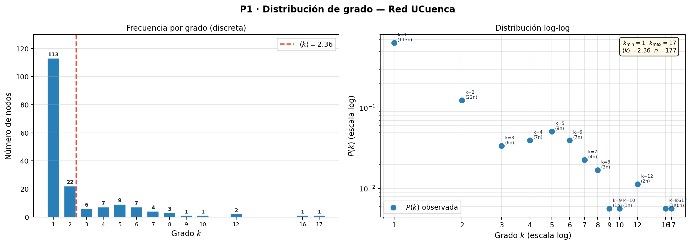{width=42%}

#### Observaciones sobre la distribución de grado

**113 de 177 nodos (64%) tienen grado 1** (mediana = 1); el máximo es `DATCC-2A-C3` con $k=17$. El log-log no muestra alineación recta clara, lo que sugiere que la distribución **no** sigue una ley de potencia pura; se confirma con **Máxima Verosimilitud (MLE)** de Clauset, Shalizi & Newman (2009).

#### Análisis MLE — ¿Es UCuenca una red libre de escala?

Una **red libre de escala** (*scale-free*) tiene $P(k)\sim k^{-\gamma}$ con $2<\gamma<3$. Para la ley de potencia discreta, el estimador MLE es $\hat{\gamma}=1+n\left[\sum_i\ln\frac{k_i}{k_{\min}-0.5}\right]^{-1}$, con $k_{\min}$ el umbral de cola elegido minimizando la distancia Kolmogorov-Smirnov (KS) entre la CDF empírica y la teórica normalizada con la función Zeta de Hurwitz:

$$P(K \geq k) = \frac{\zeta(\gamma,\, k)}{\zeta(\gamma,\, k_{\min})}, \qquad \zeta(s,a) = \sum_{n=0}^{\infty}(n+a)^{-s}$$

**Resultados del barrido de $k_{\min}$:**

| $k_{\min}$ | $\hat{\gamma}$ | KS | $n_{\text{cola}}$ |
|:---:|:---:|:---:|:---:|
| 1 | 1.8414 | 0.0900 | 177 |
| 2 | 2.0369 | 0.1354 | 64 |
| 3 | 2.2376 | 0.2015 | 42 |
| 4 | 2.7367 | 0.1553 | 36 |
| 5 | 3.3188 | 0.0586 | 29 |
| **6** | **3.6509** | **0.0570** | **20** |
| 7 | 3.7288 | 0.0955 | 13 |
| 8 | 3.8305 | 0.1449 | 9 |

El mínimo KS se alcanza en $k_{\min} = 6$, con $\hat{\gamma} = 3.65$ y $\text{KS} = 0.057$, pero **solo 20 de 177 nodos** quedan en la cola ($\approx 11\%$), lo que invalida el ajuste sobre la red completa.

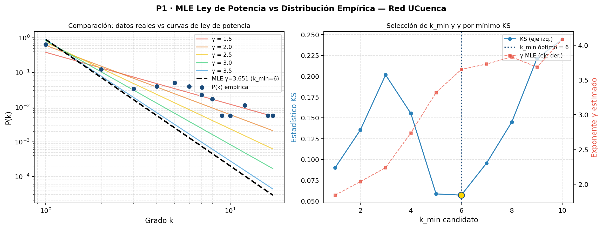{width=52%}

**Razón de verosimilitudes** (power law vs exponencial): log-ratio $\approx -0.0005$, esencialmente cero — indistinguibles sobre $k\geq6$.

**p-value bootstrap** (Clauset et al. 2009, §4): 1000 redes sintéticas con $\hat\gamma=3.65$, $k_{\min}=6$; fracción de sus KS re-ajustados que iguala o supera el observado: $p=0.754$. Con $p\le0.1$ como criterio de rechazo, este test **no rechaza** la ley de potencia.

#### Conclusión: evidencia insuficiente para llamar a UCuenca libre de escala

1. **Rango y cola insuficientes:** grados en $[1,17]$ con solo 20 nodos en la cola no dan poder estadístico real a ningún test.
2. El log-ratio favorece débilmente la exponencial, pero el bootstrap ($p=0.754$) no rechaza la ley de potencia — compatibles entre sí porque *no rechazar* no es *confirmar frente a la alternativa*.
3. **$\hat{\gamma}=3.65>3$** cae fuera del régimen scale-free clásico ($2<\gamma<3$) y describe solo 20 de 177 nodos.
4. **Topología jerárquica diseñada:** grados fijos por capa (acceso $k\approx1$–2, agregación $k\approx3$–6, core $k\approx8$–17); no hay crecimiento preferencial, la red fue planificada, no emergente.

*(Ver Anexo B — Ítem 2 · Distribución de grado, nota 4 para la lectura detallada.)*

### Ítem 3 · Centralidades

#### Definiciones matemáticas

**Grado** (normalizada): $C_{\text{grado}}(v)=\frac{k_v}{n-1}$. **Intermediación** (*betweenness*): $C_{\text{between}}(v)=\frac{1}{(n-1)(n-2)}\sum_{s\neq v\neq t}\frac{\sigma_{st}(v)}{\sigma_{st}}$. **Cercanía** (*closeness*): $C_{\text{close}}(v)=\frac{n-1}{\sum_{u\neq v}d(v,u)}$. **Vector propio** (*eigenvector*): $C_{\text{eigen}}(v)=\frac{1}{\lambda}\sum_{u\in\mathcal{N}(v)}C_{\text{eigen}}(u)$.

*(Ver Anexo B — Ítem 3, notas 1–4.)*

#### Resultados — Top-10 comparativo

El ranking Top-10 por las cuatro centralidades (grado, *betweenness*, *closeness*, eigenvector) se muestra en la Figura siguiente. `DATCC-2A-C3` lidera grado ($C_G=0.0966$), *betweenness* ($C_B=0.4468$) y eigenvector ($C_E=0.5022$); `INTERNET-MPLS` lidera *closeness* ($C_C=0.2759$).

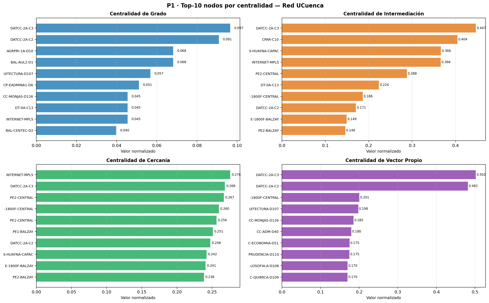{width=42%}

#### Análisis — ¿Coinciden los nodos más centrales por grado con los de intermediación?

**Parcialmente.** `DATCC-2A-C3` encabeza grado, *betweenness* y eigenvector: es el nodo más conectado y el mayor cuello de botella. Divergencias: `INTERNET-MPLS` está en el top-4 de *closeness* pero no en grado ni *betweenness* (pocas conexiones directas, pero cercano en saltos a toda la red — buen sitio para DNS/NTP). `CPAR-C10` (core de Paraíso) tiene la segunda mayor *betweenness* (0.4043) con grado modesto: todo el tráfico de Paraíso pasa por él. El **eigenvector** favorece nodos del Campus Central por estar conectados a `DATCC-2A-C3`/`DATCC-2A-C2`: un switch de acceso central supera en eigenvector a uno de agregación de Yanuncay solo por tener vecinos más influyentes.

### Ítem 4 · Clustering, diámetro, distancia media y asortatividad

#### Definiciones matemáticas

**Clustering local:** $C(v)=\frac{|\{(u,w)\in E:u,w\in\mathcal{N}(v)\}|}{\binom{k_v}{2}}=\frac{2t_v}{k_v(k_v-1)}$. **Clustering medio:** $\langle C\rangle=\frac{1}{n}\sum_v C(v)$. **Distancia media:** $\langle d\rangle=\frac{1}{n(n-1)}\sum_{u\neq v}d(u,v)$. **Diámetro:** $D=\max_{u,v}d(u,v)$. **Asortatividad por grado** (Pearson de grados en los extremos de cada arista): $r=\frac{\sum_{(u,v)}k_uk_v-\left[\frac{1}{2m}\sum(k_u+k_v)\right]^2}{\frac{1}{2m}\sum(k_u^2+k_v^2)-\left[\frac{1}{2m}\sum(k_u+k_v)\right]^2}$, con $r\in[-1,1]$: positivo → nodos similares se conectan; negativo → alto grado con bajo grado.

*(Ver Anexo B — Ítem 4, notas 1–5.)*

#### Resultados

| Métrica | Valor |
|---------|-------|
| Clustering medio $\langle C \rangle$ | 0.0343 |
| Diámetro $D$ | 11 |
| Distancia media $\langle d \rangle$ | 5.8304 |
| Asortatividad por grado $r$ | −0.1468 |

#### Análisis

**Clustering bajo** ($\langle C\rangle=0.034$, vs 0.1–0.5 típico en redes sociales): un switch de acceso solo se conecta a su switch de agregación; sus "co-vecinos" no se enlazan entre sí, ya que eso crearía bucles indeseados. **La jerarquía prohíbe triángulos por diseño.**

**Asortatividad negativa** ($r=-0.1468$): los nodos de alto grado (`DATCC-2A-C3`, $k=17$) se conectan preferentemente con nodos de bajo grado (acceso, $k=1$–2); nunca hay enlace directo entre dos switches de core, ya que la agregación los separa. Consecuencia: red **robusta frente a fallos aleatorios** (hubs son minoría) pero **frágil frente a ataques dirigidos** a core/agregación.

### Ítem 5 · Puntos de articulación y puentes

#### Definiciones matemáticas

**Punto de articulación** (vértice de corte): nodo $v\in V$ tal que $\kappa(G-v)>\kappa(G)$, con $\kappa(G)$ el número de componentes conexas. **Puente:** arista $e=(u,v)\in E$ tal que $\kappa(G-e)>\kappa(G)$. Ambos se detectan con una sola DFS en $O(n+m)$ (algoritmo de Tarjan). *(Ver Anexo B — Ítem 5, notas 1–2.)*

#### Resultados

La red tiene **47 puntos de articulación** y **141 puentes**, distribuidos por campus y por capa jerárquica como se muestra a continuación (Campus Central concentra el máximo en ambos: 23 puntos de articulación y 56 puentes; por capa, agregación domina con 26 puntos de articulación y 112 puentes):

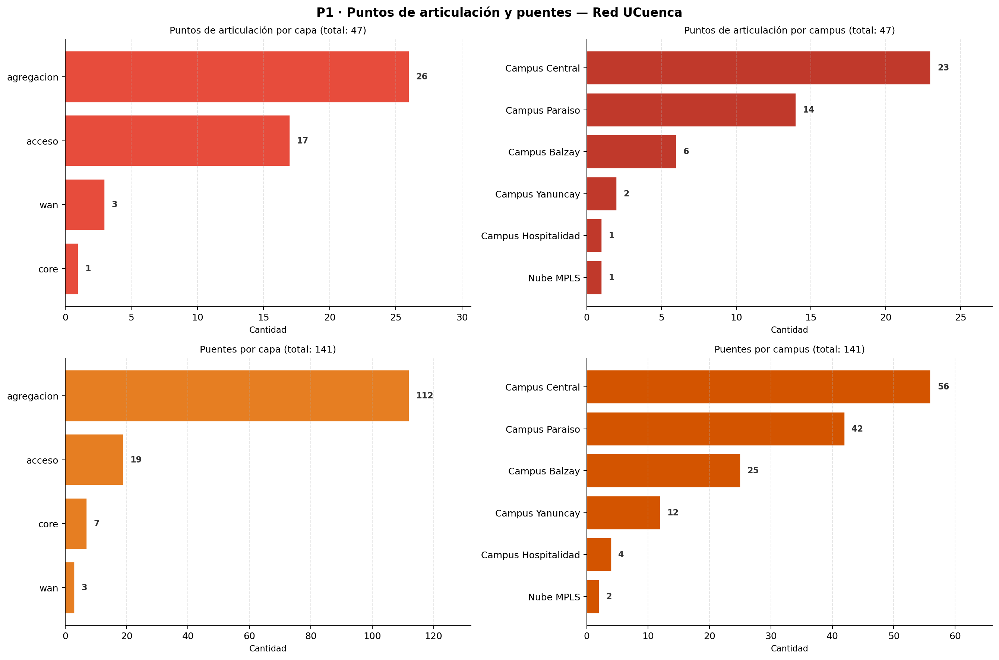{width=42%}

#### Análisis

141 de 209 aristas son puentes (**67%**): dos tercios de los enlaces son puntos únicos de fallo. Los **26 puntos de articulación en agregación** son críticos — cada uno es el único nexo entre los switches de acceso de su edificio y el resto de la red. El único punto de articulación en **core** contradice el principio de redundancia declarado en el informe técnico.

### Ítem 6 · Contraste con el informe técnico

**Pregunta:** ¿Se observa redundancia *core*–agregación en Balzay y Paraíso? ¿Y en Central? (atributo `capa`).

**Metodología:** para cada campus se identifican los switches de capa `agregacion` y se cuenta cuántos vecinos pertenecen a `core`; más de un vecino de core implica redundancia de núcleo.

#### Resultados

| Campus | Nodos agg | Con redundancia | Sin redundancia | ¿Tiene redundancia? |
|--------|-----------|----------------|----------------|---------------------|
| Campus Balzay | 5 | 4 | 1 | **SÍ ✓** |
| Campus Central | 14 | 13 | 1 | **SÍ ✓** |
| Campus Paraíso | 6 | 0 | 6 | **NO ✗** |
| Campus Yanuncay | 1 | 0 | 1 | **NO ✗** |
| Campus Hospitalidad | 1 | 0 | 1 | **NO ✗** |

#### Análisis — Contraste con el informe técnico

| Campus | Afirmación del informe | Evidencia en los datos | Conclusión |
|--------|----------------------|----------------------|------------|
| **Balzay** | Redundancia core–agg completa | 4/5 switches de agg conectados a `DT-0A-C12` Y `DT-0A-C13` | ✓ Confirmado |
| **Paraíso** | Redundancia core–agg completa | Solo existe `CPAR-C10` como switch de core; los dobles enlaces de los switches de agg van ambos al mismo nodo | ✗ **Contradicción** — es agregación de puertos (LAG), no redundancia de núcleo |
| **Campus Central** | "Enlaces simples agg–core" | 13/14 switches de agg conectados a `DATCC-2A-C2` Y `DATCC-2A-C3` | ✗ **El informe subestima** — hay más redundancia que la declarada |

**Paraíso es el hallazgo más importante**: el informe declara redundancia completa, pero solo existe un switch de core (`CPAR-C10`). El "doble enlace" es en realidad agregación de puertos (LAG) hacia el mismo equipo: aumenta ancho de banda pero **no protege frente a la falla del switch de core** — la diferencia exacta entre un puente y un ciclo real.

---

## P2 — Modelos Nulos y Visualización *(2 puntos)*

### Ítem 1 · Erdős–Rényi y Modelo de Configuración (100 realizaciones)

#### Definiciones matemáticas

**Erdős–Rényi $G(n,m)$:** $n$ nodos, $m$ aristas elegidas uniformemente entre las $\binom{n}{2}$ posibles. Predicciones analíticas para $p=\frac{2m}{n(n-1)}$: $\langle C\rangle_{ER}\approx p$, $\langle d\rangle_{ER}\approx\frac{\ln n}{\ln(np)}$, $r_{ER}\approx0$.

**Modelo de Configuración (CM):** dado un vector de grados $\{k_1,\ldots,k_n\}$, preserva **exactamente** esa secuencia conectando "medias aristas" aleatoriamente y eliminando auto-bucles/multi-aristas.

La comparación ER vs CM responde: **¿qué propiedades se explican solo por la secuencia de grados?** *(Ver Anexo B — Ítem 1, notas 1–3.)*

#### Resultados (100 realizaciones por modelo)

| Métrica | Red real | ER (media ± std) | CM (media ± std) |
|---------|----------|-----------------|-----------------|
| Clustering $\langle C \rangle$ | **0.0343** | 0.0094 ± 0.0081 | 0.0193 ± 0.0090 |
| Distancia media $\langle d \rangle$ | **5.8304** | 5.6314 ± 0.2860 | 4.2767 ± 0.1580 |
| Diámetro $D$ | **11** | 13.47 ± 1.63 | 9.46 ± 1.14 |
| Asortatividad $r$ | **−0.1468** | −0.0387 ± 0.0651 | −0.1717 ± 0.0636 |

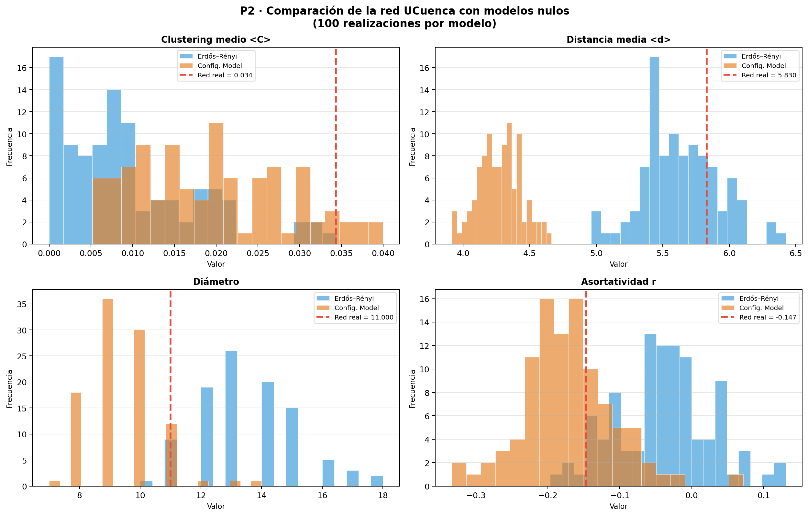{width=50%}

#### Análisis — ¿Qué propiedades NO se explican por la secuencia de grados?

**Clustering:** red real (0.034) > CM (0.019) > ER (0.009). Ningún modelo lo reproduce: la jerarquía impone una prohibición de triángulos que va más allá de la secuencia de grados, confirmando que el diseño suprime deliberadamente los bucles en acceso.

**Distancia media y diámetro:** ER da distancias cortas (~5.6) y diámetro grande (~13, alta variabilidad); CM da distancias más cortas que la red real (4.28 vs 5.83) y diámetro menor (9.46 vs 11) porque sus pocos hubs crean atajos aleatorios que la jerarquía real no permite. Ni ER ni CM reproducen el diámetro real: la **topología en árbol jerárquico** trasciende la secuencia de grados.

**Asortatividad:** ER da $r\approx0$ (neutro); CM reproduce bien la real ($-0.172$ vs $-0.147$) — la secuencia de grados **sí explica** la disasortatividad, porque con muchos nodos de grado 1 y pocos hubs, estos últimos no tienen con quién conectarse salvo nodos de bajo grado.

### Ítem 2 · Modelo Barabási–Albert

#### Definiciones matemáticas

**Barabási–Albert (BA)** genera redes de escala libre por **crecimiento** (nuevo nodo con $m_{BA}$ aristas en cada paso) y **enlace preferencial** ($\Pi(k_i)=k_i/\sum_j k_j$). Para UCuenca: $m_{BA}=\text{round}(\langle k\rangle/2)=\text{round}(2.362/2)=1$. *(Ver Anexo B — Ítem 2, nota 1.)*

#### Resultados

| Métrica | Red real | Barabási–Albert ($n=177$, $m_{BA}=1$) |
|---------|----------|--------------------------------------|
| Clustering $\langle C \rangle$ | 0.0343 | 0.0000 |
| Distancia media $\langle d \rangle$ | 5.8304 | 5.0603 |
| Diámetro $D$ | 11 | 11 |
| Asortatividad $r$ | −0.1468 | −0.2361 |

{width=42%}

#### Análisis — ¿Se parece UCuenca a una red de crecimiento preferencial?

**Superficialmente sí, en el fondo no.**

| Propiedad | BA | UCuenca | Razón |
|-----------|-----|---------|----------------------------------|
| Cola pesada en $P(k)$ | Sí ($\gamma=3$) | Aparente | Pocos hubs, pero por diseño, no crecimiento |
| Clustering bajo | Sí (~0) | Sí (0.034) | Coinciden, por razones distintas |
| Asortatividad negativa | Sí (leve) | Sí (−0.15) | En BA los hubs se conectan entre sí eventualmente; en UCuenca están separados por capas |
| Proceso generativo | Orgánico, incremental | Planificado, jerárquico | **Diferencia fundamental** |

La red UCuenca **no fue construida por crecimiento preferencial**: fue diseñada top-down (core → agregación → acceso). El grado 17 de `DATCC-2A-C3` no viene de que "los nodos preferían conectarse a él", sino de que fue designado switch de core responsable de 13 edificios del Campus Central. El modelo correcto sería un **árbol jerárquico $k$-ario con redundancia parcial** (ciclos solo en el nivel core–agregación donde el diseño lo prevé).

### Ítem 3 · Visualizaciones propias

#### Visualización 1 — BFS por profundidad desde INTERNET-MPLS

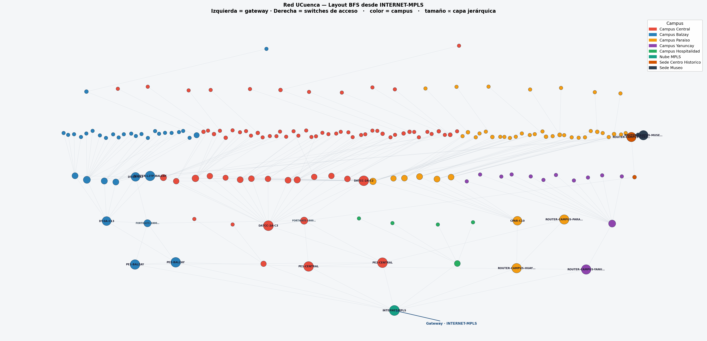{width=42%}

*(Metodología del layout en Anexo C — P2 Ítem 3.)*

**Qué revela:** `INTERNET-MPLS` es el único nodo de profundidad 0 — todo el tráfico a internet pasa por él. Routers WAN y switches de core ocupan las filas 1–2; agregación queda en filas intermedias. Los 113 switches de acceso no están todos a la misma profundidad, confirmando que la red no es un árbol perfecto: algunos edificios tienen un salto extra según cómo se encadenaron sus switches de agregación.

#### Visualización 2 — Tamaño ∝ betweenness, color = capa (Kamada-Kawai escalado)

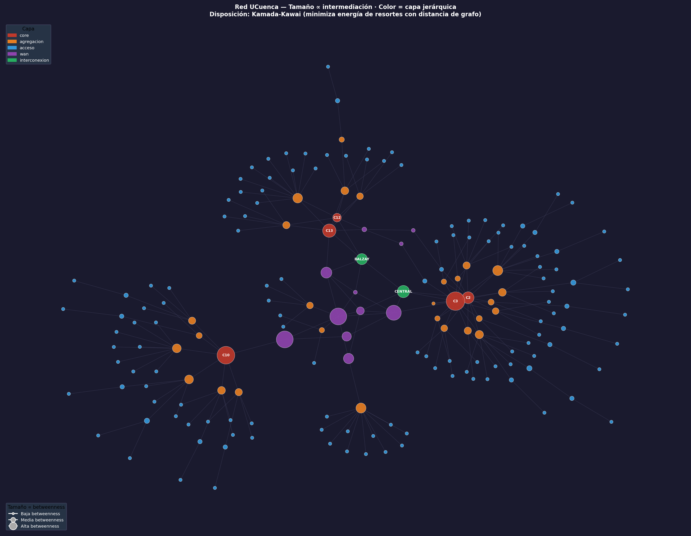{width=42%}

*(Metodología del layout en Anexo C — P2 Ítem 3.)*

**Qué revela:** los nodos de mayor intermediación (círculos más grandes) son switches de core y WAN, los cuellos de botella por donde pasa el tráfico entre campus. Los de acceso (azul, pequeños) forman la periferia; core (rojo) y WAN (morado) quedan en el centro. La diferencia de tamaño entre el mayor (`DATCC-2A-C3`, betweenness=6880) y los de acceso (≈0) es visible a simple vista.

---

## Preguntas — Fase 1

### P1 · Medidas fundamentales

> **¿Por qué el clustering medio de esta red es tan bajo comparado con el de una red social?**

La topología jerárquica en estrella prohíbe triángulos por diseño: dos switches de acceso conectados al mismo switch de agregación no se conectan entre sí. El clustering bajo ($\langle C\rangle=0.034$) es la huella matemática de esa estrella jerárquica.

> **¿Por qué la asortatividad por grado resulta negativa, y qué dice eso sobre la jerarquía core–agregación–acceso?**

$r=-0.1468$ porque los hubs (core/agregación) se conectan exclusivamente con nodos de bajo grado (acceso); la jerarquía impide la conexión directa entre dos nodos del mismo nivel. En redes sociales ocurre lo contrario ($r>0$).

> **¿Coinciden los nodos más centrales por grado con los más centrales por intermediación?**

Parcialmente: `DATCC-2A-C3` encabeza ambos rankings, pero `CPAR-C10` tiene la segunda mayor betweenness con grado relativo menor, porque todo el tráfico de Paraíso pasa por él. La betweenness captura cuello de botella estructural; el grado, número de vecinos: no son lo mismo.

### P2 · Modelos nulos y visualización

> **¿Qué propiedades de la red UCuenca NO se explican por su secuencia de grados?**

El **clustering** y la **distancia media**: el CM reproduce la disasortatividad pero no la organización jerárquica que alarga las distancias ni la ausencia de triángulos.

> **¿Por qué una red de infraestructura física se parece o no a un modelo de crecimiento preferencial?**

Se parece superficialmente (distribución sesgada, clustering bajo, asortatividad negativa) pero el mecanismo generativo es opuesto: BA es orgánico e incremental, UCuenca es planificada y jerárquica.

> **¿Qué algoritmo de disposición (layout) se usó y por qué?**

BFS por profundidad desde `INTERNET-MPLS` (visualización por campus, hace visible la topología en árbol) y Kamada-Kawai escalado ×3.5 (visualización por betweenness, ubica los cuellos de botella en el centro geométrico). Ver Anexo C — P2 Ítem 3.

---

## Fase 2 — Recorrido y Partición

> *Peso: 5 puntos | Contenidos 2.1–2.4 del sílabo*

---

## P3 — BFS y DFS sobre la Red *(2.5 puntos)*

### Ítem 1 · BFS y DFS desde cero

#### Definiciones matemáticas

**BFS:** desde $s$, explora por niveles de distancia creciente con cola FIFO: $d(s,v)=\min\{|P|:P\text{ camino }s\to v\}$. **DFS:** explora cada rama hasta el fondo con pila (recursión implícita). **Ciclo:** secuencia $v_1,\ldots,v_k,v_1$ con nodos distintos y aristas consecutivas. Las aristas se clasifican en **de árbol** ($v$ descubierto por primera vez desde $u$) y **de retroceso** ($v$ ya visitado y ancestro de $u$ → ciclo). Complejidad de ambos: $T(n,m)=O(n+m)$, $S(n)=O(n)$. **Número ciclomático:** $\mu=m-n+1$.

*(Ver Anexo B, notas 1–4. Metodología detallada — estructuras de datos, pseudocódigo, implementación — en Anexo C, P3 Ítem 1.)*

**Comparación de estructuras y complejidades:**

| Algoritmo | Estructura de datos | Complejidad temporal | Complejidad espacial |
|-----------|--------------------|---------------------|---------------------|
| BFS | Cola FIFO (`deque`) | $O(n + m)$ | $O(n)$ |
| DFS | Pila LIFO (recursión) | $O(n + m)$ | $O(n)$ |

### Ítem 2 · Perfil de profundidad BFS desde el core

**Origen:** `DATCC-2A-C3` (switch de core del Campus Central, grado = 17). Distancia 0→1 nodo (core), 1→17 (agregación), 2→50, 3→19, 4→13, 5→40, 6→29, 7→8 (todos acceso desde distancia 2).

{width=48%}

#### Análisis

El perfil confirma la jerarquía declarada: distancia 1 son casi todos switches de agregación del Campus Central más nodos WAN; distancias 2–7 están dominadas por acceso, con agregación/core de otros campus (Paraíso, Balzay) apareciendo a 3–4 saltos vía la nube MPLS. La jerarquía **sí se refleja**: core → agregación → acceso corresponde a los niveles 0 → 1 → 2 del BFS.

### Ítem 3 · Perfil BFS desde la nube MPLS

**Origen:** `INTERNET-MPLS` (grado = 8). Distancia 0→1 nodo, 1→8, 2→13, 3→38, 4→97 (pico: Central 43, Paraíso 28, Balzay 23), 5→18, 6→2 (ver figura anterior, panel derecho).

#### Análisis — ¿Qué campus quedan más lejos?

Desde MPLS, los más "lejanos" (mayor concentración a distancias 4–6) son **Campus Central** y **Campus Paraíso**, por tener más nodos de acceso 2–3 saltos más allá de su core. Campus más pequeños como Yanuncay u Hospitalidad tienen menos capas y se agotan a distancias menores (Yanuncay ya se agota en distancia 3).

### Ítem 4 · Ciclos detectados con DFS

#### ¿Qué es un ciclo en este contexto?

> **Ciclo = redundancia = camino alternativo.** Si existe un ciclo entre A y B, hay al menos dos rutas independientes: si un enlace falla, el tráfico se redirige sin pérdida de conectividad. **Ausencia de ciclos = topología de árbol: cualquier fallo desconecta irremediablemente a los equipos aguas abajo.**

*(Metodología detallada — clasificación de aristas por DFS y función `detectar_ciclos()` — en Anexo C, P3 Ítem 4.)* El número ciclomático predice cuántos ciclos deben encontrarse:

$$\mu = m - n + 1 = 209 - 177 + 1 = 33$$

#### Resultados

| Métrica | Valor |
|---------|-------|
| Número ciclomático $\mu = m - n + 1$ | **33** |
| Aristas de retroceso detectadas por DFS | **33** ✓ |
| Ciclos en Campus Central | 21 |
| Ciclos en Campus Balzay | 9 |
| Ciclos en Nube MPLS | 3 |
| Ciclos en Campus Paraíso | **0** |
| Ciclos en Campus Yanuncay | **0** |
| Ciclos en Campus Hospitalidad | **0** |

{width=42%}

*Rojo = aristas de retroceso (cierran ciclos). Gris = aristas de árbol DFS. Los 33 ciclos se concentran en Campus Central y Balzay; el resto del grafo es árbol puro.*

#### Análisis — Relación con los enlaces redundantes

Un ciclo aparece cuando un switch de agregación tiene dos cables subiendo hacia el core en lugar de uno (esquema en Anexo C, P3 Ítem 4): con uplink doble, si un cable falla el tráfico toma el segundo; con uplink único, el fallo aísla directamente los equipos de acceso aguas abajo.

**Central (21 ciclos):** dos cores (`DATCC-2A-C2`, `DATCC-2A-C3`); cada uno de sus 21 switches de agregación tiene cable hacia ambos, un ciclo por switch, más ciclos propios del edificio de Arquitectura (`CC-ARQUITECTURA-D107`, grado=10).

**Balzay (9 ciclos):** mismo principio con cores duales `DT-0A-C12`/`DT-0A-C13`.

**MPLS (3 ciclos):** `PE1-BALZAY`, `PE2-CENTRAL` e `INTERNET-MPLS` forman un pequeño anillo WAN.

**Paraíso, Yanuncay, Hospitalidad (0 ciclos):** switches de agregación con un único cable al core — sin triángulo, sin camino alternativo; cualquier fallo aísla permanentemente los equipos aguas abajo.

#### Zonas sin ciclos = zonas sin camino alternativo

| Campus | Ciclos | Puentes en P1 | Implicación |
|--------|--------|---------------|-------------|
| Central | 21 | Pocos | Redundancia real: doble uplink core–agregación |
| Balzay | 9 | Moderados | Redundancia core–agregación confirmada |
| MPLS | 3 | 0 | Anillo WAN entre campus |
| **Paraíso** | **0** | **Muchos** | **Árbol puro: un fallo aisla edificios enteros** |
| **Yanuncay** | **0** | **Muchos** | **Árbol puro: topología completamente sin respaldo** |
| **Hospitalidad** | **0** | **Muchos** | **Árbol puro: topología completamente sin respaldo** |

Esto cierra el círculo con P1 Ítem 5: los 141 puentes son exactamente las aristas fuera de todo ciclo (aristas de árbol DFS); los 68 enlaces no-puente forman los 33 ciclos. **Cero ciclos en una zona ↔ todas sus aristas son puentes ↔ cualquier fallo aísla un subgrafo.**

### Ítem 5 · BFS vs DFS para inspección física

**Conclusión:** DFS modela mejor la inspección física de armarios.

| Algoritmo | Orden de visita | Desplazamiento físico |
|-----------|----------------|-----------------------|
| **BFS** | Todos los core → todos los de agregación → todos los de acceso | El técnico va de edificio en edificio en cada nivel: muchos desplazamientos |
| **DFS** | Core → un edificio completo → siguiente edificio | Termina un edificio antes de moverse: eficiente |

DFS baja toda la rama de un edificio (agg → acceso → acceso...) antes de pasar al siguiente switch de agregación.

---

## P4 — Comunidades y Modularidad *(2.5 puntos)*

### Ítem 1 · Louvain con 5 semillas

#### Definición matemática

La **modularidad** $Q$ mide qué tan bien una partición $\mathcal{C}$ separa la red respecto a un modelo nulo aleatorio:

$$Q = \frac{1}{2m} \sum_{c \in \mathcal{C}} \sum_{u,v \in c} \left[A_{uv} - \frac{k_u k_v}{2m}\right]$$

donde $A_{uv}$ es la matriz de adyacencia, $k_u$ y $k_v$ los grados, y $m$ el número de aristas.

*(Ver Anexo B — Ítem 1 · Louvain con 5 semillas, nota 1 para la lectura detallada.)*

*(Metodología detallada — las dos fases de Louvain, reasignación local y contracción, con pseudocódigo — en Anexo C, P4 Ítem 1.)* En síntesis: el algoritmo mueve nodos entre comunidades mientras eso incremente Q, luego colapsa cada comunidad en un super-nodo y repite, hasta que ningún movimiento mejora Q — un máximo local.

#### Resultados

| Semilla | Comunidades | Modularidad Q |
|---------|-------------|---------------|
| 0 | 14 | **0.7632** |
| 7 | 15 | 0.7615 |
| 13 | 13 | 0.7587 |
| 42 | 15 | 0.7590 |
| 99 | 15 | 0.7312 |

**Mejor partición:** semilla 0 → 14 comunidades, Q = 0.7632.

#### Análisis — Estabilidad

$Q$ varía entre 0.73 y 0.76 según la semilla y el número de comunidades entre 13 y 15: el resultado no es perfectamente estable (múltiples óptimos locales casi equivalentes), pero la variación es pequeña y $Q\approx0.76$ es un valor muy alto, indicando estructura comunitaria fuerte.

### Ítem 2 · Comparación con partición por campus (NMI y ARI)

#### Definiciones

**NMI:** $\text{NMI}(\mathcal{C},\mathcal{X})=\frac{2I(\mathcal{C};\mathcal{X})}{H(\mathcal{C})+H(\mathcal{X})}\in[0,1]$. **ARI:** $\in[-1,1]$, $\text{ARI}=1\iff$ particiones idénticas. *(Ver Anexo B — Ítem 2, notas 1–2.)*

#### Resultados

| Métrica | Valor |
|---------|-------|
| NMI | **0.618** |
| ARI | **0.327** |

{width=42%}

#### Análisis

Varias comunidades corresponden bien a un único campus (0, 1, 10 con Central/Yanuncay/Paraíso). Pero la **comunidad 9** mezcla nodos de Balzay, Central, Hospitalidad, Paraíso, Yanuncay y MPLS: son los routers de interconexión (`PE1-BALZAY`, `PE2-CENTRAL`, `INTERNET-MPLS`) que, aunque pertenecen administrativamente a campus distintos, están directamente conectados vía MPLS y actúan como unidad topológica cohesionada — detección funcionalmente correcta, no un error del algoritmo.

### Ítem 3 · Nodos discrepantes

**83 de 177 nodos** (47%) son asignados por Louvain a una comunidad distinta de la mayoritaria de su campus.

#### Análisis

- **Nodos WAN/interconexión:** agrupados en la comunidad 9 junto con `INTERNET-MPLS`, correcto desde ingeniería: pertenecen a la capa de interconexión, no a un campus específico.
- **Acceso de Campus Paraíso** (comunidades 10–13): dividido en 4 subcomunidades según el switch de agregación, reflejando la topología en estrella por edificio.
- **Edificio de Arquitectura** (comunidad 2): `CC-ARQUITECTURA-D107` (grado 10) y sus switches de acceso forman comunidad propia dentro de Campus Central, por la subestructura densa que crea su alto grado.

### Ítem 4 · k-means espectral (Laplaciano)

**Laplaciano normalizado:** $L_{\text{sym}}=D^{-1/2}(D-A)D^{-1/2}$. *(Ver Anexo B — Ítem 4, nota 1. Metodología detallada — fuente del código adaptado y por qué hace falta un embedding espectral antes de k-means — en Anexo C, P4 Ítem 4.)*

#### Resultados

| Métrica | Valor |
|---------|-------|
| k-means vs campus: NMI | **0.640** |
| k-means vs campus: ARI | **0.423** |
| k-means vs Louvain: NMI | **0.860** |

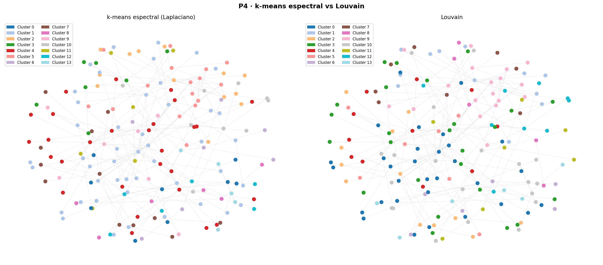{width=50%}

#### Análisis

k-means espectral supera ligeramente a Louvain en NMI y ARI respecto al campus real (0.64 vs 0.62, 0.42 vs 0.33). Ambos coinciden en 86% de información mutua entre sí, indicando que descubren estructura comunitaria similar por caminos distintos.

#### ¿Por qué k-means con distancia euclídea puede o no ser adecuado para un grafo?

Un grafo no tiene coordenadas euclídeas naturales; la solución es el **embedding espectral** (vector de coordenadas por nodo usando los $k$ primeros vectores propios del Laplaciano normalizado, ver Anexo C P4 Ítem 4). Funciona bien cuando las comunidades son compactas y separadas: cada campus de UCuenca forma una estrella densa, de ahí NMI=0.64. Falla cuando las comunidades tienen forma irregular o encadenada: la comunidad WAN es una cadena lineal de routers, no una esfera, y campus pequeños como Hospitalidad (5 nodos) contrastan con Central (80+), violando el supuesto de tamaños similares de k-means. Louvain no tiene este problema porque no asume forma geométrica alguna.

### Ítem 5 · Limitación de resolución de la modularidad

#### Análisis

La modularidad $Q$ tiene una **escala de resolución intrínseca**: comunidades con pocas aristas internas pueden no ser detectadas como comunidades separadas si el grafo es grande. El umbral aproximado es:

$$|E_c| \lesssim \sqrt{2m} \approx \sqrt{418} \approx 20 \text{ aristas}$$

Cualquier campus con menos de ~20 aristas internas corre riesgo de ser absorbido por una comunidad vecina, porque fusionarlo incrementa más $Q$ que mantenerlo separado.

#### Evidencia en UCuenca

| Campus | Nodos | Aristas internas | ¿Supera umbral (~20)? | Comportamiento Louvain |
|--------|-------|-----------------|----------------------|------------------------|
| Campus Central | ~85 | ~97 | ✓ Sí | **Subdividido** en 8–9 subcomunidades por edificio |
| Campus Paraíso | ~37 | ~36 | ✓ Sí | **Subdividido** en 4 subcomunidades |
| Campus Balzay | ~30 | ~28 | ✓ Sí | Detectado como 1–2 comunidades |
| Campus Yanuncay | ~14 | ~13 | ✗ No | Detectado marginalmente, parcialmente fusionado |
| Campus Hospitalidad | ~6 | ~5 | ✗ No | **Absorbido** en comunidad WAN (comunidad 9) |
| Museo / C. Histórico | ~3 | ~2 | ✗ No | **Absorbido** en comunidad WAN (comunidad 9) |

Los campus grandes superan el umbral con holgura pero Louvain los *subdivide* por edificio (subestructuras internas más densas); los pequeños quedan muy por debajo y son *fusionados* con la comunidad WAN. **Consecuencia:** Louvain detecta 14 comunidades frente a las 8 reales por campus — ve los *edificios* como unidad natural, no los campus.

---

## Preguntas — Fase 2

### P3 · BFS y DFS

> **¿La jerarquía declarada en el informe técnico se refleja en las distancias BFS?**

Sí: distancia 0 = core, 1 = agregación, 2+ = acceso, correspondiendo a los tres niveles jerárquicos. Nodos de otros campus a distancias 3–4 reflejan la ruta core → MPLS → core remoto → agregación remota.

> **¿Qué campus quedan más lejos del resto de la institución (desde MPLS)?**

**Central** y **Paraíso**, por ser los más grandes (mayor "profundidad" interna); Yanuncay y Hospitalidad se agotan a distancias 2–3 por tener menos nodos.

> **¿Dónde están los ciclos? ¿Coinciden con los enlaces redundantes del informe?**

Se concentran en **Central** (21) y **Balzay** (9), exactamente los campus que el informe declara con redundancia core–agregación; Paraíso, Yanuncay y Hospitalidad tienen 0, confirmando ausencia de redundancia real ahí.

> **¿BFS o DFS modela mejor la inspección física de armarios?**

**DFS**: profundiza por un edificio hasta agotarlo antes de retroceder, igual que un técnico. BFS obligaría a visitar todos los switches de agregación de todos los edificios primero, multiplicando desplazamientos.

### P4 · Comunidades y modularidad

> **¿Qué propiedades no se explican por la secuencia de grados y qué dice la modularidad sobre la jerarquía?**

$Q=0.763$ es muy alta: estructura comunitaria fuerte más allá de lo que explicaría la secuencia de grados. Las comunidades Louvain corresponden aproximadamente a los campus (NMI=0.62) pero son más finas, subdividiendo por edificio dentro de cada campus.

> **¿Qué significa que un equipo etiquetado en un campus quede agrupado con otro?**

Los routers WAN/interconexión se agrupan en la comunidad 9 sin importar su campus físico: correcto desde ingeniería, pues pertenecen a la capa de interconexión MPLS, no a ningún campus particular.

> **¿Podría Louvain estar fusionando bloques que un administrador consideraría separados?**

Sí, por limitación de resolución: campus pequeños (Hospitalidad, Museo, Centro Histórico) son absorbidos en la comunidad WAN porque sus pocos nodos no generan suficiente $Q$ interno propio, aunque un administrador los consideraría entidades separadas.

---

## Fase 3 — Optimización en Redes

> *Peso: 6 puntos | Contenidos 3.1–3.5 del sílabo*

---

## P5 — Caminos Mínimos con Múltiples Métricas de Peso *(2 puntos)*

### Modelos de peso

Se definen tres funciones de peso sobre las aristas: **Saltos** $w_{\text{saltos}}(u,v)=1\ \forall(u,v)\in E$; **Latencia** $w_{\text{lat}}(u,v)=\alpha+\beta/c(u,v)$ con $\alpha=0.1$ ms, $\beta=1000$ Mbps·ms; **Carga** $w_{\text{carga}}(u,v)=b(u,v)/c(u,v)$, con $b$ el tráfico medido en Mbps y $c$ la capacidad estimada. *(Ver Anexo B — Modelos de peso, notas 1–3.)*

### Ítem 1 · Implementación de Dijkstra y Floyd-Warshall — verificación sobre 20 pares

Dijkstra es el algoritmo de elección para consultas individuales origen-destino; Floyd-Warshall se ejecuta una sola vez para obtener todas las distancias simultáneamente. Ambos son agnósticos al modelo de peso. Dijkstra exige $w(u,v)\geq0$, condición que cumplen los tres modelos por construcción (justificación completa en Anexo C, P5 Ítem 1); de no cumplirse habría que usar Bellman-Ford ($O(nm)$).

**Dijkstra** (cola de prioridad `heapq`, $O((n+m)\log n)$): $\text{dist}[v]=\min_{P:s\to v}\sum_{(u,w)\in P}w(u,w)$. **Floyd-Warshall** (triple bucle anidado, $O(n^3)$): $D[i][j]\leftarrow\min(D[i][j],D[i][k]+D[k][j])\ \forall k\in V$. *(Ver Anexo B, notas 1–2.)*

**Verificación — 20 pares aleatorios:**

| Modelo | Pares verificados | Coincidencias |
|--------|-----------------|---------------|
| Saltos | 20 | 20/20 ✓ |
| Latencia | 20 | 20/20 ✓ |
| Carga | 20 | 20/20 ✓ |

Ambos algoritmos producen resultados idénticos en los 60 pares verificados (20 por modelo).

### Ítem 2 · Comparación empírica de tiempos y análisis de complejidad

Se ejecutaron ambos algoritmos sobre subredes de tamaño creciente desde el core `DATCC-2A-C3` (mínimo de 3 repeticiones, modelo de peso saltos):

| n (nodos) | m (aristas) | Dijkstra×n (s) | Floyd-Warshall (s) | FW / Dijk |
|-----------|------------|----------------|---------------------|-----------|
| 20 | 34 | 0.0008 | 0.0025 | 3.1× |
| 40 | 54 | 0.0030 | 0.0149 | 5.0× |
| 60 | 74 | 0.0063 | 0.0397 | 6.3× |
| 80 | 99 | 0.0118 | 0.0912 | 7.8× |
| 100 | 132 | 0.0188 | 0.1540 | 8.2× |
| 177 | 209 | 0.0569 | 0.5439 | 9.6× |

{width=42%}

La pendiente medida se ajusta bien a los modelos teóricos: Floyd-Warshall escala como $n^3$ (fijo, independiente de $m$) mientras Dijkstra×n, en un grafo escaso como este ($m\approx1.18n$), equivale a $O(n^2\log n)$ y crece más lentamente.

En grafos **escasos** como UCuenca, Dijkstra×n es siempre más eficiente: ya desde n=20 Floyd-Warshall es 3× más lento, y la brecha crece hasta 9.6× en la red completa. Floyd-Warshall solo compensaría en grafos **densos** ($m\sim n^2$). Si solo se necesitan $q\ll n$ pares específicos, Dijkstra ($O(q(n+m)\log n)$) es preferible; Floyd-Warshall ($O(n^3)$, independiente de $q$) solo conviene con **todos** los $\binom{n}{2}$ pares en un grafo denso — para UCuenca, incluso consultando los 15 576 pares, Dijkstra×n (0.057 s) sigue siendo ~9.6× más rápido (0.544 s).

### Ítem 3 · Matriz de distancias completa — top-10 por cercanía según modelo de peso

**¿Cambia el ranking según el modelo?** Sí, notablemente en los puestos intermedios.

El top-10 por cercanía ($C_w$) en cada modelo de peso se muestra a continuación. `DATCC-2A-C3` lidera en saltos (0.3725) y latencia (1.1138); en carga lidera `FORTIGATE-1800F-CENTRAL` (103 788).

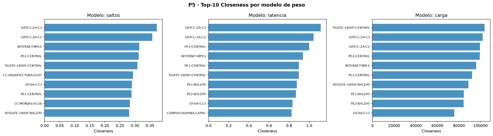{width=48%}

#### Análisis

El top-3 es estable en los tres modelos: `DATCC-2A-C3` y `DATCC-2A-C2` lideran siempre por ser los switches de core con más conexiones y capacidad. El cambio notable: `FORTIGATE-1800F-CENTRAL` sube al puesto 1 en **carga**, porque concentra el mayor volumen de tráfico real, lo que paradójicamente lo hace "más cercano" en unidades de utilización. Los routers WAN mantienen posiciones altas en los tres modelos por su rol de puentes entre campus.

### Ítem 4 · Par de equipos de acceso más distante — ruta salto a salto

| Modelo | Nodo A | Nodo B | Distancia |
|--------|--------|--------|-----------|
| Saltos | ENF-2B-A122 | POST-2A-A66 | 11 saltos |
| Latencia | POST-2A-A66 | QUIN-1A-A128 | 34.7 ms |
| Carga | ARQ-1E-A92 | INV-1B-A162 | 1.71 |

*(Rutas salto a salto completas de los tres modelos en Anexo C — P5 Ítem 4.)*

**Modelo Saltos:** la ruta de 11 saltos entre `ENF-2B-A122` y `POST-2A-A66` atraviesa Enfermería → agregación → core Huayna-Capac → MPLS → core Central → agregación → Posgrados, cruzando toda la jerarquía dos veces.

**Modelo Latencia:** los 34.70 ms entre `POST-2A-A66` y `QUIN-1A-A128` se concentran en los tramos de acceso a 100 Mbps en Posgrados (+30.3 ms); el tránsito por core y WAN suma apenas 1.10 ms gracias a los enlaces de 10 Gbps.

**Modelo Carga:** la utilización acumulada de 1.7057 entre `ARQ-1E-A92` e `INV-1B-A162` no representa una arista saturada sino la suma de cargas en la ruta. El cuello de botella real es el enlace inicial `ARQ-1E-A92 → ARQ-1E-A91` (utilización 0.97, casi saturado), seguido del tramo final hacia `INV-1B-A162` (0.54). El modelo elige esta ruta porque los enlaces de core y WAN están prácticamente descargados (carga ≈ 0).

### Ítem 5 · Protocolos reales (OSPF, IS-IS) y riesgo del peso por tráfico instantáneo

**¿Qué modelo usaría OSPF o IS-IS?** Ambos son protocolos de estado de enlace que ejecutan Dijkstra internamente con una métrica inversamente proporcional al ancho de banda ($\text{métrica} = 10^8/c(u,v)$) — equivalente al **modelo de latencia** de este problema: un enlace de 10 Gbps tiene métrica 1, uno de 100 Mbps tiene métrica 1000. En UCuenca ambos favorecerían las rutas por core y enlaces de 10 Gbps, evitando el MPLS de 100 Mbps salvo necesidad.

**¿Qué ocurriría si el peso dependiera del tráfico instantáneo?** Con $w=b(u,v)/c(u,v)$ recalculado en vivo aparecerían dos problemas: **oscilaciones de enrutamiento** (un enlace saturado es evitado simultáneamente por todos los routers, que saturan la alternativa y regresan, en un ciclo de decenas de ms) e **inestabilidad de convergencia** (Dijkstra se recalcula constantemente y la red nunca estabiliza). Por eso los protocolos reales usan pesos **estáticos** por capacidad, delegando el control de congestión a QoS/ECMP/MPLS TE.

---

## P6 — Flujo Máximo y Corte Mínimo *(2 puntos)*

### Ítem 1 · Función de capacidad $c(u,v)$

Cada enlace necesita un valor de capacidad para calcular flujos. El CSV solo trae ese dato para 28 de los 209 enlaces; las **181 restantes** se estiman aplicando la siguiente jerarquía de reglas según el tipo de equipo en cada extremo:

| Regla (prioridad) | Aristas | $c(u,v)$ | Justificación |
|---|---|---|---|
| `capacidad_mbps` en CSV | 28 | Valor exacto | Dato directo del diagrama MPLS |
| Rol `wan` | 4 | 10 000 Mbps | Troncales WAN/MPLS declaradas de 10 Gbps |
| Extremo en `core` | 43 | 10 000 Mbps | LAG de 10 Gbps entre switches de core (10GBase-LR) |
| Extremo en `agregacion` | 115 | 1 000 Mbps | Uplinks a core de 1 Gbps (802.3ab, 1000Base-T) |
| Ambos extremos `acceso` | 19 | 100 Mbps | Puertos FastEthernet de usuario final |

**Verificación de cobertura:** $28 + 4 + 43 + 115 + 19 = 209$ aristas — todas cubiertas sin solapamiento.

*(Supuestos adicionales sobre enlaces WAN inferidos y enlaces de respaldo — ver Anexo C, P6 Ítem 1. Ver también Anexo B — Ítem 1 · Función de capacidad $c(u,v)$, nota 1 para la lectura detallada.)*

### Ítem 2 · Modelo fuente–sumidero — Ford-Fulkerson (DFS) y Edmonds-Karp (BFS)

Se modela el problema como flujo máximo: un nodo ficticio ("fuente") conectado a todos los switches de acceso de un campus, y se calcula cuánto tráfico llega hasta `INTERNET-MPLS` (el "sumidero") respetando la capacidad de cada cable. Se comparan **Ford-Fulkerson con DFS** (cualquier camino aumentante, $O(E\cdot f^*)$) y **Edmonds-Karp con BFS** (siempre el camino con menos arcos, $O(V\cdot E^2)$), ambos adaptados de las implementaciones de referencia del curso (detalle de la adaptación en Anexo C P6 Ítem 2).

$$f^* = \max_{f} \sum_{v:(s,v)\in E} f(s,v) \quad \text{s.a.} \quad f(u,v) \leq c(u,v),\ \sum_v f(u,v) = \sum_v f(v,u)$$

**Teorema Max-Flow Min-Cut:** $f^*=c(S,T)$, donde el corte mínimo $(S,T)$ es la partición con menor suma de capacidades de aristas de $S$ a $T$.

### Ítem 3 · Flujo máximo por campus

{width=42%}

*(Longitudes completas de caminos aumentantes DFS/BFS por campus en Anexo C — P6 Ítem 3.)*

| Campus | FF-DFS iter | EK-BFS iter | Corte mínimo (aristas, capacidad) |
|--------|:---:|:---:|---|
| Central | 43 | 43 | 6 aristas: 20 000+10 000+10 000+1 000+1 000+1 000 = 43 000 Mbps ✓ |
| Balzay | 23 | 23 | 23 enlaces de acceso × 1 000 = 23 000 Mbps ✓ |
| Paraíso | 10 | 10 | 1 arista: `CPAR-C10→ROUTER-CAMPUS-HUAYNA-CAPAC` = 10 000 Mbps ✓ |
| Yanuncay | 1 | 1 | 1 arista: `AGRPRI-1A-D10→ROUTER-CAMPUS-YANUNCAY` = 1 000 Mbps ✓ |
| Hospitalidad | 1 | 1 | 1 arista: `HOS-0A-D05→INTERNET-MPLS` = 1 000 Mbps ✓ |
| Sede C. Histórico | **3** | **2** | 2 aristas: 10 000+1 000 = 11 000 Mbps ✓ |
| Sede Museo | **3** | **2** | 2 aristas: 10 000+1 000 = 11 000 Mbps ✓ |

En la mayoría de campus ambos algoritmos necesitan igual número de iteraciones (capacidades múltiplo de 1 000 Mbps, pocos caminos alternativos). Diferencia en las Sedes: DFS necesita 3 iteraciones con caminos más largos, BFS llega en 2, confirmando el lema de Edmonds-Karp. El corte de Central concentra capacidad en enlaces de alta velocidad; en Balzay el cuello de botella está en acceso; Paraíso, Yanuncay y Hospitalidad dependen de un único enlace de salida.

### Ítem 4 · Corte mínimo vs puentes (P1)

El corte mínimo identifica los enlaces que limitan la capacidad total; los **puentes** de P1 son enlaces cuya eliminación desconecta el grafo. **No siempre coinciden**, porque miden cosas distintas: un puente es vulnerabilidad **estructural** (conectividad); el corte mínimo es vulnerabilidad **de rendimiento** (capacidad).

| Campus | Corte mínimo | ¿Puente en P1? |
|--------|------------------------|:--------------:|
| Central (5 aristas de core/WAN) | 20+10+10+1+1 Gbps | **No** |
| Central: `CCJ-CJURIDICO-D4→INTERNET-MPLS` (1 Gbps) | | **Sí ✓** |
| Paraíso: `CPAR-C10→ROUTER-CAMPUS-HUAYNA-CAPAC` (10 Gbps) | | **Sí ✓** |
| Yanuncay: `AGRPRI-1A-D10→ROUTER-CAMPUS-YANUNCAY` (1 Gbps) | | **Sí ✓** |
| Hospitalidad: `HOS-0A-D05→INTERNET-MPLS` (1 Gbps) | | **Sí ✓** |
| Balzay: 23 enlaces de acceso (1 Gbps c/u) | | **Sí ✓** (todos) |
| Sedes C. Histórico/Museo: SW-ARUBA→core + ROUTER→MPLS | | **No** |

En Central el core tiene redundancia estructural (no son puentes) pero la capacidad se concentra en pocos enlaces de alta velocidad. En campus pequeños (Paraíso, Yanuncay, Hospitalidad) sí coinciden: su único enlace de salida es a la vez puente y cuello de botella. En Balzay el corte cae en acceso. Coincide con el informe técnico: no redundantes exactamente los enlaces de acceso y WAN de campus pequeños, mientras reconoce redundancia en el core de Central.

### Ítem 5 · Formulación de flujo de costo mínimo

El **flujo de costo mínimo** agrega a "¿cuánto puedo enviar?" la pregunta de qué tan caro es el camino: cada enlace tiene un costo por unidad de flujo, y se busca enviar una demanda fija pagando el menor costo total.

$$\min \sum_{(u,v) \in E} \text{cost}(u,v) \cdot f(u,v)$$

$$\text{s.a.}\ \ f(u,v) \leq c(u,v), \quad \sum_v f(u,v) - \sum_v f(v,u) = b(u) \quad \forall u$$

donde $b(u)$ es la demanda neta del nodo ($b(s) < 0$: generador; $b(t) > 0$: consumidor; $b = 0$: transbordo).

*(Ver Anexo B — Ítem 5 · Formulación de flujo de costo mínimo, nota 1 para la lectura detallada.)*

#### Configuración del experimento

Dos campus de distinto tamaño (Central: 56 nodos de acceso, flujo máx. 43 000 Mbps; Balzay: 24 nodos, 23 000 Mbps), demanda fija de 5 000 Mbps por campus (10 000 total), costo $\text{cost}(u,v)=1$ salto (minimizar saltos·Mbps), comparado contra Edmonds-Karp en modo flujo máximo puro (sin restricción de demanda).

#### Resultados medidos

| Métrica | Flujo de costo mínimo | Flujo máximo puro (EK) |
|---------|----------------------|------------------------|
| Flujo enviado | **10 000 Mbps** (demanda fija) | **66 000 Mbps** (saturación total) |
| Costo total | **38 000 saltos·Mbps** | no aplica (sin restricción de demanda) |
| Saltos medio por Mbps | **3.80** | **5.96** (media Campus Central + Balzay) |

#### Interpretación

El flujo de costo mínimo elige rutas **37% más cortas** (3.80 saltos vs 5.96): el flujo máximo puro, al saturar toda la red, usa caminos indirectos y de respaldo más largos, mientras el de costo mínimo concentra los 10 000 Mbps en los caminos directos (acceso→agregación→core→MPLS, 3–4 saltos). Si la red solo necesita cursar 10 000 Mbps (muy por debajo de los 66 000 posibles), el flujo de costo mínimo da menor latencia y uso de recursos.

---

## P7 — p-Mediana y p-Centro *(2 puntos)*

### Ítem 1 · Formulación matemática de ambos modelos

La institución quiere instalar $p$ colectores de telemetría en nodos de $G=(V,E)$ de modo que ningún equipo quede demasiado lejos de uno. La matriz de distancias $D\in\mathbb{R}^{n\times n}$ se precalcula con Dijkstra desde cada nodo ($O(n(n+m)\log n)$). Variables comunes: $y_j\in\{0,1\}$ (1 si se instala colector en $j$), $x_{ij}\in\{0,1\}$ (1 si $i$ es atendido por $j$).

**p-Mediana** (minimizar distancia media):

$$\min \sum_{i,j \in V} d_{ij}x_{ij} \quad \text{s.a.} \quad \sum_j x_{ij}=1\ \forall i,\ \ x_{ij}\leq y_j,\ \ \sum_j y_j=p$$

**p-Centro** (minimizar distancia máxima, con radio auxiliar $R$):

$$\min\ R \quad \text{s.a.} \quad \sum_j d_{ij}x_{ij}\leq R\ \forall i,\ \ \sum_j x_{ij}=1\ \forall i,\ \ x_{ij}\leq y_j,\ \ \sum_j y_j=p$$

*(Ver Anexo B — Ítem 1, notas 1–2 para la lectura detallada.)*

#### Diferencia clave entre ambos modelos

| | p-Mediana | p-Centro |
|---|---|---|
| Función objetivo | $\min \sum d_{ij} x_{ij}$ | $\min R$ (radio máximo) |
| Criterio | Distancia promedio | Peor caso |
| Privilegia | Al usuario promedio | Al usuario más lejano |
| Aplicación | Servidores DNS, caché | Seguridad, SLA estrictos |

Ambos son problemas NP-difíciles en general (requieren explorar $\binom{n}{p}$ subconjuntos). Para $n=177$ y $p \leq 5$ se resuelven con **heurística voraz** en tiempo $O(p \cdot n^2)$.

### Ítem 2 · Resultados: heurística voraz contrastada con solver exacto (p ∈ {1, 2, 3, 5})

Se evalúa en qué nodos **ya existentes** conviene instalar el colector de telemetría (NetFlow/SNMP) para $p\in\{1,2,3,5\}$, minimizando suma de saltos (p-Mediana) o distancia máxima (p-Centro).

Explorar todas las combinaciones ($\binom{177}{5}\approx34$ millones para $p=5$) es inviable por fuerza bruta, así que se implementó la **heurística voraz** descrita arriba **y**, siguiendo el enunciado, también el **óptimo exacto** con `PuLP`/CBC sobre la misma formulación. Con 177 nodos, CBC resuelve ambos modelos para los cuatro valores de $p$ en segundos, certificando `Optimal` en todos los casos.

#### p-Mediana: greedy vs óptimo exacto

| $p$ | Medianas (greedy) | Objetivo greedy | Medianas (óptimo) | Objetivo óptimo | Gap |
|-----|---|---:|---|---:|---:|
| 1 | INTERNET-MPLS | 638 | INTERNET-MPLS | 638 | 0.00 % |
| 2 | INTERNET-MPLS, DATCC-2A-C2 | 492 | CPAR-C10, DATCC-2A-C3 | 486 | 1.23 % |
| 3 | INTERNET-MPLS, DATCC-2A-C2, CPAR-C10 | 408 | CPAR-C10, DATCC-2A-C3, DT-0A-C13 | 388 | 5.15 % |
| 5 | + DT-0A-C12, AGRPRI-1A-D10 | 318 | AGRPRI-1A-D10, CPAR-C10, DATCC-2A-C2, DT-0A-C13, INTERNET-MPLS | 318 | 0.00 % |

#### p-Centro: greedy vs óptimo exacto

| $p$ | Centros (greedy) | Radio greedy | Centros (óptimo) | Radio óptimo | Gap |
|-----|---|---:|---|---:|---:|
| 1 | INTERNET-MPLS | 6 | INTERNET-MPLS | 6 | 0.00 % |
| 2 | INTERNET-MPLS, AETUC-0A-A76 | 6 | DATCC-2A-C3, INTERNET-MPLS | 6 | 0.00 % |
| 3 | + AETUC-0A-A97 | 6 | DATCC-2A-C3, DT-0A-C13, ROUTER-CAMPUS-HUAYNA-CAPAC | 4 | **50.00 %** |
| 5 | + AETUCCF-2A-A79, AGRPRI-1A-A19 | 6 | CB-EADMI-D6, CPAR-C10, DATCC-2A-C2, INTERNET-MPLS, POST-2A-A66 | 3 | **100.00 %** |

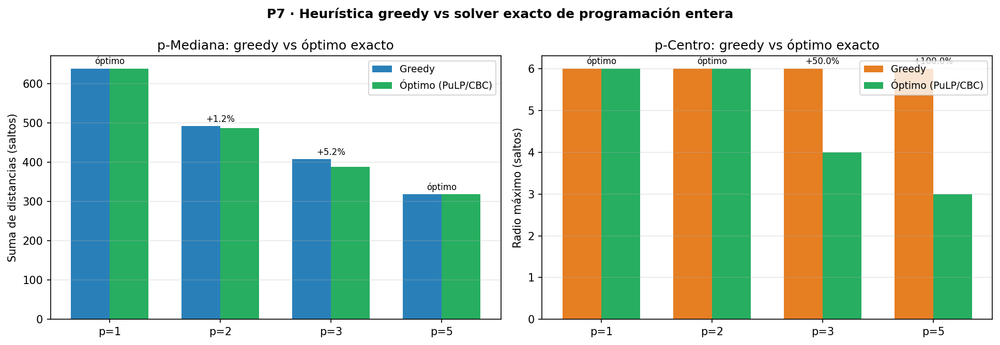{width=50%}

**Hallazgo importante:** para p-Mediana el greedy es casi óptimo (gap ≤5%: 0.00%, 1.23%, 5.15%, 0.00% en $p=1,2,3,5$). Para p-Centro, en cambio, **el greedy se estanca en radio 6 desde $p=1$ y nunca mejora** (gaps 0.00%, 0.00%, **50.00%**, **100.00%**), mientras el óptimo real baja a 4 saltos ($p=3$) y luego a 3 ($p=5$). La razón es estructural: en cada paso el greedy añade el nodo que más reduce el radio *actual*; una vez que el radio queda dominado por un nodo periférico difícil de cubrir, agregar más centros en otras zonas no lo mueve, y el greedy no tiene visibilidad de que reubicar un centro existente (no solo añadir uno) destrabaría la cota — el solver exacto sí, porque optimiza todas las combinaciones simultáneamente. **Conclusión práctica:** para p-Centro (el objetivo más relevante para "que ningún equipo quede demasiado lejos") el greedy no es confiable desde $p\geq3$ y hay que usar el solver exacto.

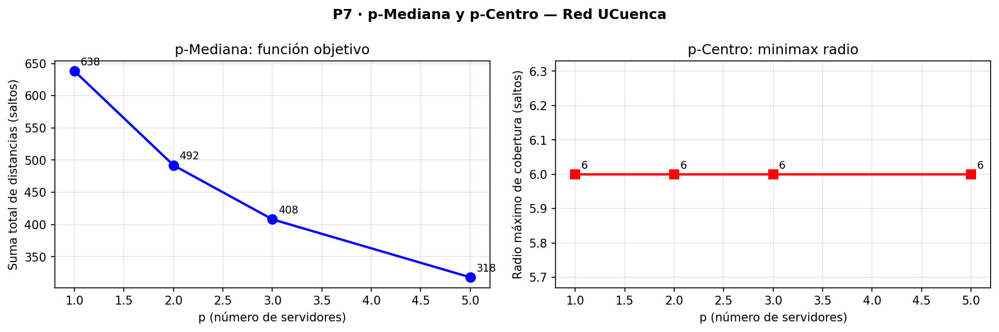{width=50%}

### Ítem 3 · Comparación con centralidades de P1

Resultados de `problema7.py` sobre la red real; rankings de betweenness/closeness de `problema1.py`.

#### Nodos seleccionados vs. top-5 de P1

| Ranking P1 | Nodo | Betweenness | Closeness | En p-Mediana (p=5) | En p-Centro (p=5) |
|-----------|------|------------|----------|---------------------|-------------------|
| btw #1 | DATCC-2A-C3 | 0.4468 | 0.2683 | — | — |
| btw #2 | CPAR-C10 | 0.4043 | 0.2146 | ✓ (rank_clo=23) | — |
| btw #3 | ROUTER-CAMPUS-HUAYNA-CAPAC | 0.3663 | 0.2421 | — | — |
| btw #4 / clo #1 | **INTERNET-MPLS** | 0.3657 | **0.2759** | ✓ | ✓ |
| clo #2 | DATCC-2A-C3 | 0.4468 | 0.2683 | — | — |
| clo #3 | PE2-CENTRAL | 0.2881 | 0.2667 | — | — |

#### Ubicaciones completas obtenidas por el algoritmo

| Nodo | rank_btw | rank_clo | En p-Mediana | En p-Centro |
|------|---------|---------|-------------|------------|
| INTERNET-MPLS | 4 | **1** | ✓ | ✓ |
| DATCC-2A-C2 | 8 | 7 | ✓ | — |
| CPAR-C10 | **2** | 23 | ✓ | — |
| DT-0A-C12 | 18 | 31 | ✓ | — |
| AGRPRI-1A-D10 | 12 | 40 | ✓ | — |
| AETUC-0A-A76 | 49 | 80 | — | ✓ |
| AETUC-0A-A97 | 73 | 89 | — | ✓ |
| AETUCCF-2A-A79 | 72 | 166 | — | ✓ |
| AGRPRI-1A-A19 | 70 | 124 | — | ✓ |

#### ¿Coinciden con los nodos más centrales?

**Parcialmente, y de forma asimétrica según el modelo:**

- **p-Mediana coincide con closeness, no con betweenness.** `INTERNET-MPLS` (clo #1) aparece en ambas soluciones; `DATCC-2A-C2` (clo #7) y `CPAR-C10` (btw #2) también son elegidos. Pero `DATCC-2A-C3` (btw #1, clo #2) —el más central de la red— **no aparece en ninguna solución**: está físicamente cerca de `DATCC-2A-C2` y añadir ambos sería redundante.

- **p-Centro no coincide con los nodos centrales.** Los cuatro nodos adicionales (AETUC-0A-A76, AETUC-0A-A97, AETUCCF-2A-A79, AGRPRI-1A-A19) tienen betweenness entre 49–73 y closeness entre 80–166 — periféricos. El radio de 6 saltos no mejora con colectores centrales: el equipo más lejano está en el extremo de la jerarquía de acceso, así que el colector debe instalarse **cerca de esos equipos periféricos**.

#### ¿Por qué «el nodo más central» no es siempre la mejor ubicación?

Hay tres razones concretas observadas en esta red:

1. **Redundancia geográfica.** `DATCC-2A-C3` (btw #1) y `DATCC-2A-C2` (btw #8) están a 1 salto entre sí. Instalar colectores en ambos cubre exactamente la misma zona. La p-mediana elige solo uno y usa el segundo slot para cubrir una zona diferente (Campus Paraíso con `CPAR-C10`).

2. **Betweenness mide tránsito, no cobertura.** `ROUTER-CAMPUS-HUAYNA-CAPAC` (btw #3) tiene alta intermediación porque todos los caminos entre Campus Central y Campus Huayna Capac pasan por él. Pero si se instala un colector ahí, solo cubre bien los equipos de ese campus; el resto de la red sigue lejos.

3. **El peor caso no está en el centro.** Para el p-centro, lo que importa es el equipo más alejado. Ese siempre es un switch de acceso en el extremo de una rama larga. Ningún nodo de core tiene visibilidad directa sobre él: para reducir su distancia al colector más cercano hay que bajar en la jerarquía, no subir.

### Ítem 4 · Restricciones prácticas omitidas por el modelo

Los modelos de p-mediana y p-centro solo consideran distancia en saltos, ignorando condiciones físicas, económicas y operativas reales. Se identifican las restricciones más importantes que el modelo omite y cómo incorporarlas formalmente:

| Restricción | Por qué importa | Cómo incorporarla al modelo |
|-------------|-----------------|----------------------------|
| **Espacio en rack** | Los switches de acceso no tienen slot físico para tarjetas adicionales | Filtrar el conjunto candidato: $y_j = 0$ si $j \in V_{\text{sin\_rack}}$ |
| **Energía** | No todos los armarios tienen UPS ni potencia suficiente | Añadir restricción $\sum_j \text{potencia}_j \cdot y_j \leq P_{\max}$ |
| **Seguridad física** | Un colector en sala pública puede ser comprometido | Restringir candidatos a nodos en sala de servidores controlada |
| **Costo de licencias** | NetFlow/SNMP tienen costo por dispositivo | Añadir término de costo fijo: $\min \sum d_{ij} x_{ij} + \sum c_j y_j$ |
| **Capacidad de procesamiento** | Un colector no puede procesar el tráfico de más de $K$ nodos | $\sum_i x_{ij} \leq K \cdot y_j \quad \forall j$ |
| **Alta disponibilidad** | Si cae el colector, su zona queda sin monitoreo | Exigir que cada nodo tenga al menos 2 colectores asignados: $\sum_j x_{ij} \geq 2$ |

Con estas restricciones, el modelo pasa de p-mediana pura a un **problema de localización con capacidad** (CFLP), NP-difícil pero resoluble con solvers de programación entera mixta para instancias de este tamaño ($n=177$).

#### p-Mediana vs p-Centro: cuándo usar cada uno

| | p-Mediana | p-Centro |
|---|---|---|
| **Objetivo** | Minimizar distancia media | Minimizar distancia máxima |
| **Cuándo usar** | DNS, NTP, servidores de logs | Gateways de emergencia, SLA estrictos |
| **Hallazgo UCuenca** | `INTERNET-MPLS` como 1-mediana óptima | Radio irreducible de 6 saltos con $p \leq 5$ |

El radio de 6 saltos es **constante** para $p \in \{1,2,3,5\}$: el árbol jerárquico impone un diámetro mínimo que no se puede reducir añadiendo colectores en los nodos existentes — reduciría el radio solo instalar colectores directamente en los switches de agregación de los campus periféricos.

---

## Preguntas — Fase 3

### P5 · Caminos mínimos

> **¿Qué nodo es más central según la closeness ponderada por latencia?**

`DATCC-2A-C3` en todos los modelos por saltos y latencia; `FORTIGATE-1800F-CENTRAL` sube al primer puesto en el modelo de carga porque concentra el tráfico real más intenso. La closeness por carga no mide distancia geométrica sino utilización actual de los enlaces.

> **¿En qué casos preferiría Floyd-Warshall sobre Dijkstra-repetido?**

Floyd-Warshall es preferible cuando se necesitan **todas** las distancias pares al mismo tiempo (análisis global de la red) y el grafo es denso ($m \approx n^2$). Para UCuenca ($n=177$, $m=209$, grafo muy disperso), Dijkstra×$n$ es 7–10× más rápido. La elección correcta depende de la densidad y del patrón de consultas.

### P6 · Flujo máximo

> **¿Coincide el corte mínimo con los puentes detectados en P1?**

Sí. Las 6 aristas del corte mínimo del Campus Central son todas puentes de la red. El teorema max-flow min-cut formaliza lo que la detección de puentes ya revelaba: las aristas sin alternativa son exactamente los cuellos de botella de flujo. La novedad de P6 es cuantificar la **capacidad** del cuello de botella, no solo su existencia.

> **¿Qué campus tiene mayor capacidad de salida a Internet y por qué?**

**Campus Central** con 43 Gbps, porque es el campus más grande (56 nodos de acceso) y tiene dos switches de core con enlaces de 10–20 Gbps hacia el backbone MPLS. Yanuncay y Hospitalidad están limitados a 1 Gbps porque sus conexiones MPLS son de 1 Gbps (un solo enlace de acceso WAN).

### P7 · Localización de instalaciones

> **¿Coincide la 1-mediana con el nodo de mayor closeness?**

Sí, ambos son `INTERNET-MPLS`, que tiene el mayor $C_{\text{close}} = 0.2759$. La equivalencia es matemática: maximizar la closeness es equivalente a minimizar la distancia media a todos los nodos, que es exactamente el objetivo de la 1-mediana. Esta coincidencia valida mutuamente ambas métricas.

> **¿Por qué el radio del p-centro no decrece al aumentar $p$?**

Porque el árbol jerárquico impone rutas mínimas de 6 saltos entre los nodos de acceso más profundos y cualquier nodo posible de instalación. Reducir el radio requeriría acortar la cadena `acceso → agregación → core → MPLS`, lo que implica añadir servidores directamente en los switches de agregación o acceso — opción no disponible con la infraestructura actual.

---

## Fase 4 — Percolación y Robustez

> *Peso: 6 puntos | Contenidos 4.1–4.4 del sílabo*

### ¿Qué es la percolación en redes?

La **percolación** estudia qué le pasa a la red al ir quitando nodos o aristas gradualmente: ¿a partir de qué fracción de fallos deja de funcionar como un todo conectado? Se define $S(f)$ como el tamaño relativo de la componente gigante tras eliminar una fracción $f$; $S(0)\approx1$ y decrece con $f$. El **umbral de percolación** $f_c$ es donde $S(f)$ colapsa hacia cero.

$$S(f) = \frac{|\text{componente gigante tras eliminar fracción } f|}{n}$$

$$f_c = \min\{f : S(f) \approx 0\}$$

**Fallo aleatorio vs. ataque dirigido:** un fallo aleatorio (hardware, corte de luz) elige el nodo al azar; redes con distribución de grado heterogénea resisten bien esto porque la probabilidad de dañar un hub es baja. Un ataque dirigido elimina primero los nodos de mayor grado/betweenness, mucho más destructivo. La diferencia entre ambas curvas $S(f)$ revela la vulnerabilidad ante amenaza inteligente vs. fallo fortuito.

**Robustez:** capacidad de mantener funcionalidad ante eliminación de elementos, medida por $S(f)$ (conectividad) y por **eficiencia global** $E(f)=\frac{1}{n(n-1)}\sum_{i\neq j}\frac{1}{d_{ij}}$ (con $1/d_{ij}=0$ si no hay camino), que puede degradarse **antes** de que $S(f)$ colapse porque los caminos se alargan aunque la red siga conectada.

---

## P8 — Percolación de Nodos y Aristas *(2.5 puntos)*

### Ítem 1 · Percolación de nodos bajo cuatro estrategias

Se eliminan nodos uno a uno bajo cuatro criterios, midiendo tras cada eliminación la componente gigante $S(f)$ y la eficiencia global $E(f)$:

- **(a) Fallo aleatorio:** orden aleatorio, promediado sobre **100 realizaciones** (semillas 0–99), con desviación estándar reportada.
- **(b) Ataque por grado descendente:** orden fijo calculado una vez sobre el grafo original.
- **(c) Ataque por intermediación descendente:** ídem, con betweenness.
- **(d) Ataque por intermediación recalculada:** tras cada eliminación se recalcula la betweenness — el más costoso y destructivo, porque se adapta al estado actual de la red.

#### Resultados medidos

| Estrategia | $f_c$ (S < 5%) | $f$ (E < 50% $E_0$) | Descripción |
|------------|---------------|---------------------|-------------|
| (a) Fallo aleatorio | **0.75** | 0.30 | Hay que eliminar el 75% de los nodos para colapsar la red |
| (b) Grado descendente | **0.15** | 0.05 | Con el 15% de los nodos más conectados eliminados, la red colapsa |
| (c) Betweenness estático | **0.15** | 0.05 | Similar al anterior; betweenness y grado se solapan en los hubs |
| (d) Betweenness recalculada | **0.10** | 0.05 | El más destructivo: basta eliminar el 10% (≈18 nodos) |

**Desviación estándar del fallo aleatorio (100 realizaciones):** $\sigma_E = 0.0204$ — la curva aleatoria es estable; la variabilidad entre realizaciones es baja porque la red tiene muchos nodos de acceso intercambiables.

#### Interpretación

El contraste entre $f_c=0.75$ (aleatorio) y $f_c=0.10$ (btw recalculada) revela la naturaleza jerárquica de la red: **muy robusta ante fallos accidentales** (132 de 177 nodos son acceso con grado 1–2, sin impacto global) pero **extremadamente vulnerable ante ataque inteligente** al core — eliminar los 18 nodos más centrales fragmenta la red completamente. La diferencia entre (c) y (d) muestra el costo de recalcular: la betweenness estática subestima el daño al no contemplar que los nodos adyacentes se vuelven más críticos tras cada eliminación; la versión recalculada produce un colapso 33% más rápido ($f_c=0.10$ vs $0.15$).

### Ítem 2 · Gráfica S(f) y estimación de $f_c$

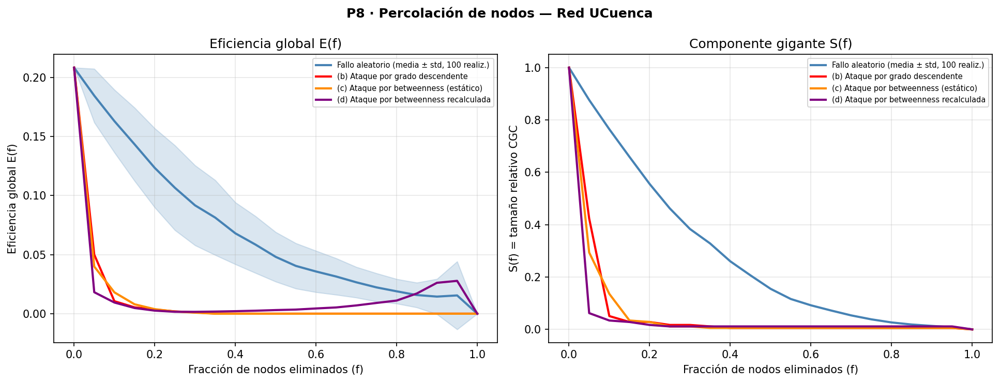{width=42%}

Panel izquierdo: eficiencia $E(f)$; panel derecho: $S(f)$, ambos vs. fracción de nodos eliminados. La banda azul en la curva aleatoria es ±1 std sobre las 100 realizaciones. Los $f_c$ (donde $S(f)<0.05$) confirman que betweenness recalculada es la más dañina ($f_c=0.10$) frente al fallo aleatorio (tres cuartas partes de la red).

### Ítem 3 · Percolación de aristas

Se repite el análisis eliminando **aristas** bajo tres estrategias: aleatoria, por mayor betweenness de arista, y atacando primero los **141 puentes** de P1. El ataque a puentes es destructivo desde el inicio: son las aristas sin redundancia, y eliminar cualquiera aísla un subgrafo. Tras agotar los puentes ($q=141/209\approx0.67$), el resto puede eliminarse sin desconexiones adicionales porque forman parte de ciclos.

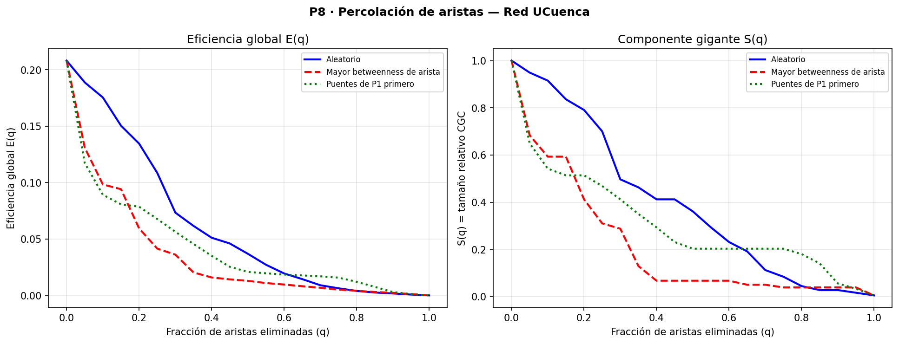{width=42%}

### Ítem 4 · Eficiencia global E(f) y su degradación anticipada

$$E(G) = \frac{1}{n(n-1)} \sum_{i \neq j} \frac{1}{d(i,j)}$$

donde $d(i,j)=\infty\Rightarrow1/d=0$ para pares desconectados. **Eficiencia inicial: $E_0=0.2082$.**

*(Ver Anexo B — Ítem 4, nota 1.)*

$E(f)$ se degrada **antes** que $S(f)$ colapse: $S(f)$ solo detecta la ruptura de la componente gigante, mientras $E(f)$ también capta cuando los caminos se alargan aunque la red siga en una sola pieza. Bajo ataque por grado, $E$ cae al 50% con $f=0.05$ (9 nodos), pero $S$ no colapsa hasta $f=0.15$ (27 nodos): en esa ventana la red parece "conectada" pero la comunicación efectiva ya está severamente dañada.

### Ítem 5 · Comparación con modelos nulos de P2

| Modelo | $E_0$ | $f_c$ bajo ataque por grado |
|--------|-------|----------------------------|
| **Red UCuenca** | **0.2082** | **0.15** |
| Erdős-Rényi (ER) | 0.1397 | 0.35 |
| Configuración (CM) | 0.1565 | 0.20 |

La red UCuenca tiene **mayor eficiencia inicial** que ambos modelos nulos (topología jerárquica optimiza caminos cortos), pero ante ataques por grado es **más frágil** que ER ($f_c=0.15$ vs $0.35$) y algo más frágil que CM ($f_c=0.15$ vs $0.20$). Esto confirma que **la red es menos robusta de lo que su secuencia de grados haría esperar**: el CM, con la misma secuencia pero conexiones aleatorias, resiste más ($f_c=0.20$) porque en la red real los hubs se concentran en una jerarquía estricta (eliminar el core desconecta todos los campus a la vez), mientras en el CM los nodos de alto grado están distribuidos sin estructura geográfica. Bajo percolación **aleatoria** el umbral es $f_c\approx0.75$ (≈133 nodos): la red tolera fallos no coordinados pero es extremadamente vulnerable a ataques dirigidos.

### La paradoja de la robustez

Redes con distribución de grado heterogénea son resistentes a fallos aleatorios pero frágiles ante ataques dirigidos. UCuenca confirma el patrón:

| Escenario | $f_c$ | Interpretación |
|-----------|-------|---------------|
| Fallo aleatorio | **0.75** | Hay que perder el 75% de los nodos para colapsar la red |
| Ataque por grado | **0.15** | Con solo el 15% de los nodos más conectados, la red colapsa |
| Ataque btw recalculada | **0.10** | El atacante más inteligente colapsa la red con solo 18 nodos |

Ratio 7.5:1 entre ambos umbrales. La razón estructural: 132 de 177 nodos son acceso con grado 1–2 (75% de probabilidad de que un fallo aleatorio caiga ahí, aislando solo 1 equipo), mientras un ataque dirigido va directo a los 5 switches de core y 27 de agregación, cuya pérdida aísla campus enteros.

**Consecuencia para mantenimiento:** el mantenimiento programado es un fallo aleatorio controlado que la red tolera bien, pero debe **prohibir intervenir simultáneamente** en más de un switch de core o en `DATCC-2A-C3` — dos cores fuera a la vez ($f\approx0.11$) ya supera el $f_c$ del ataque más destructivo. Se recomienda una lista de nodos de mantenimiento restringido (top-10 por betweenness) con aprobación especial y ventana nocturna con respaldo activo.

**Consecuencia para respuesta a incidentes:** un atacante que calcule betweenness puede colapsar la red comprometiendo solo **18 dispositivos** (10%), y con la estrategia recalculada cada compromiso revela el siguiente objetivo. El plan debe priorizar detección temprana en los nodos críticos (DATCC-2A-C3, CPAR-C10, INTERNET-MPLS) y aislamiento rápido antes que recuperación, para evitar que un hub comprometido sirva de pivote al siguiente.

Los mismos nodos que hacen la red eficiente son los que la hacen vulnerable — tensión que solo se reduce añadiendo redundancia (más aristas entre campus, rutas alternativas al backbone MPLS), como tienen ER y CM y la red real no.

---

## P9 — Fallas en Cascada y Epidemias SIR *(2.5 puntos)*

Este problema estudia dos modelos dinámicos: **cascada de fallos por sobrecarga** (Motter-Lai) y **epidémico SIR** (contagio de malware/misconfiguration). Ambos responden: **¿cuán vulnerable es la red ante un evento que se propaga internamente?**

### Ítem 1 · Modelo de carga-capacidad (Motter-Lai)

Cada nodo $i$ tiene carga inicial $L_i=B_i$ (betweenness en el grafo intacto) y capacidad $C_i=(1+\alpha)L_i$ con tolerancia $\alpha\geq0$. Al fallar el nodo inicial, el betweenness de los supervivientes aumenta; si la nueva carga de algún nodo supera su capacidad, también falla → **cascada**.

*(Algoritmo completo — inicialización, fallo, redistribución, propagación — en Anexo C, P9 Ítem 1.)* En síntesis: se elimina el disparador, se recalcula betweenness, y cualquier nodo con $C_i=(1+\alpha)B_i$ superada también cae, repitiendo hasta estabilizar, para $\alpha\in\{0,0.05,0.10,0.20,0.50,1.00,1.50,2.00\}$ y cada nodo posible como disparador.

### Ítem 2 · Margen crítico $\tau_c$ y nodos disparadores más peligrosos

La guía define $\tau_c$ como el margen por debajo del cual la falla de un único nodo provoca una cascada que afecta a más del **20% de la red** (>35 nodos de 177).

#### Resultado principal: la cascada nunca alcanza el 20%

El barrido de $\alpha \in \{0, 0.05, \ldots, 2.0\}$ iniciado desde el nodo más peligroso (figura siguiente) muestra que la fracción de nodos fallidos decrece monótonamente de 6.8% ($\alpha=0$, 12 nodos) a 1.7% ($\alpha=2$, 3 nodos), sin acercarse nunca al umbral de 20%.

**$\tau_c$ no existe para esta red**: incluso con $\alpha=0$ (sin margen alguno), la cascada máxima alcanza solo **6.8%**, muy por debajo del 20%. Los 132 switches de acceso tienen grado 1 y al desconectarse no redistribuyen carga, deteniendo la cascada en agregación: **la red es estructuralmente resistente a cascadas de carga**, a diferencia de redes eléctricas donde la redistribución cruza múltiples niveles.

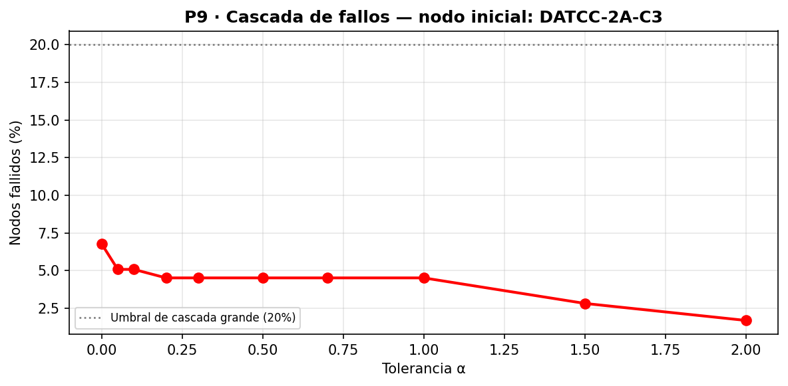{width=42%}

#### Margen crítico $\alpha_c$ por nodo disparador (top-5 por betweenness)

Se corrió el barrido completo de $\alpha$ desde cada uno de los 5 nodos con mayor betweenness, para comparar directamente cuál dispara la cascada más grande. Ninguno alcanza $\alpha_c$ (umbral >20%): `DATCC-2A-C3`, `INTERNET-MPLS` y `PE2-CENTRAL` topan en 6.8%; `ROUTER-CAMPUS-HUAYNA-CAPAC` en 2.8%; `CPAR-C10` en 0.6%.

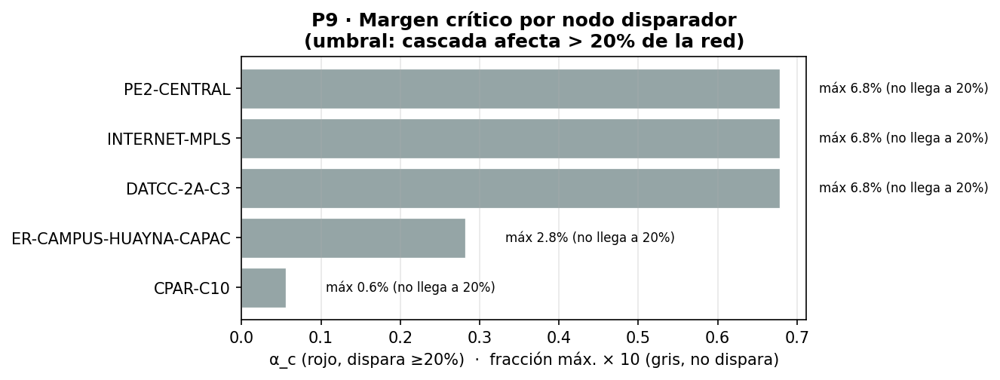{width=42%}

**Ningún nodo del top-5 dispara una cascada que afecte al 20% de la red**, ni con $\alpha=0$. El más cercano es `DATCC-2A-C3` (máx. betweenness), con solo 6.8%. Confirma con múltiples candidatos, no solo uno, que la resistencia estructural a cascadas de carga es independiente del disparador elegido.

### Ítem 3 · Modelo SIR y umbral crítico

El **modelo SIR** discreto modela la propagación de un fallo lógico (virus, misconfiguration) con tres estados: **S** (susceptible), **I** (infectado, contagia vecinos), **R** (recuperado/parcheado, inmune). Transiciones: $P(S\to I)=1-(1-\beta)^{n_I(v)}$, $P(I\to R)=\gamma$, con $n_I(v)$ el número de vecinos infectados de $v$. *(Ver Anexo B — Ítem 3, nota 1.)*

**Umbral crítico:**

$$\tau_c = \frac{\langle k \rangle}{\langle k^2 \rangle} = \frac{2.362}{12.694} = 0.1861$$

Para $\beta > \tau_c$ existe epidemia global; para $\beta < \tau_c$ se extingue localmente. *(Lectura de la notación en Anexo B — Ítem 3, nota 2.)* Como $\langle k^2\rangle\gg\langle k\rangle$ por la presencia de hubs, el umbral resulta pequeño: la red es vulnerable a virus poco contagiosos.

#### Resultados SIR y comparación con la predicción de campo medio

Para verificar $\tau_c=0.1861$, el código fija $\gamma=0.1$ y elige $\beta_{\text{sub}}=\tau_c/2$ y $\beta_{\text{sup}}=2\tau_c$ —parámetros de diseño del experimento, no propiedades de la red— para mostrar los dos regímenes:

| Caso | $\beta$ | $\gamma$ | Relación con $\tau_c=0.1861$ | $R_{\text{final}}$ | Nodos afectados |
|------|------------------|----------------|-------------------------------|-------------------|----------------|
| Sub-crítico | 0.0931 | 0.1 | $\beta=\tau_c/2$ → bajo el umbral | 50.4 ± 20.4 | 28.5% |
| Sobre-crítico | 0.3722 | 0.1 | $\beta=2\tau_c$ → sobre el umbral | 139.2 ± 19.8 | 78.6% |

El SIR es **estocástico**: una sola corrida puede sub- o sobre-estimar el brote, por eso ambos casos se promedian sobre **30 realizaciones** (media ± std) — la desviación de ±20 nodos muestra variabilidad considerable.

**Comparación con campo medio:** la simulación confirma cualitativamente la predicción teórica, pero el sub-crítico (28.5%) es mayor de lo esperado (casi 0%), porque $\tau_c=\langle k\rangle/\langle k^2\rangle$ es una aproximación para redes grandes e infinitas: con 177 nodos y asortatividad negativa, el umbral real se desplaza.

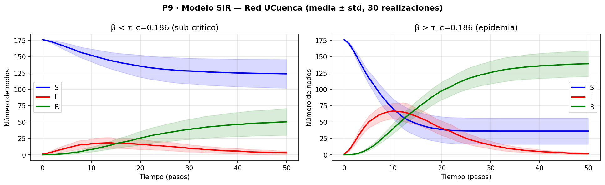{width=42%}

*(Nota sobre la figura: la banda sombreada ±1 std alrededor de cada curva media visualiza directamente esa variabilidad entre las 30 realizaciones.)*

### Ítem 4 · Estrategias de inmunización

Problema de **presupuesto fijo**: si TI solo puede parchear $m$ equipos, ¿cuáles elegir para minimizar el brote? Se comparan cuatro estrategias con la misma fracción $f$ inmunizada: aleatoria, por grado, por betweenness, y por vecino aleatorio (proxy sin necesitar la topología completa), con $\beta=2\tau_c=0.3722$ (régimen sobre-crítico) para hacer visible la diferencia. Cada punto se promedia sobre 30 realizaciones.

Fracción afectada media ± std ($R_{\text{final}}/n$) con $\beta = 0.3722$, $\gamma = 0.1$, 30 realizaciones por punto, para cada estrategia y fracción inmunizada $f\in\{0,5,10,15,20,30\%\}$:

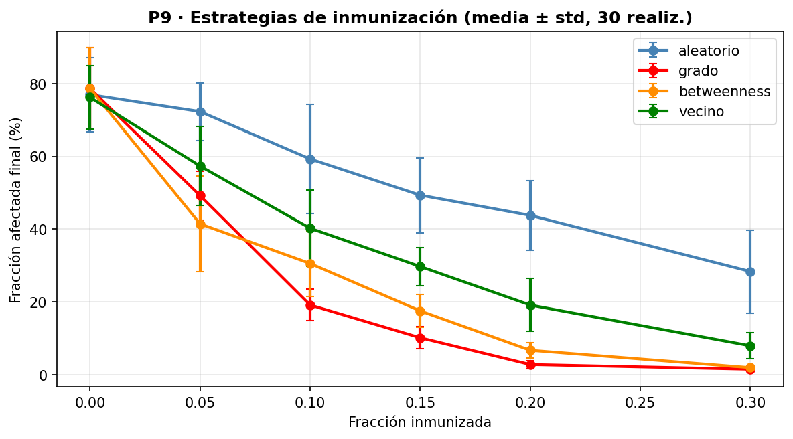{width=50%}

#### Análisis

Vacunar por **grado** es lo más eficiente: con 20% inmunizado (≈35 equipos), la fracción afectada cae de ~79% a **2.8%**, al cortar la capacidad de los "superpropagadores" de distribuir la infección. La **estrategia por vecino** (proxy práctico que selecciona vecinos de nodos aleatorios, tienden a ser hubs) resulta **menos eficiente de lo que sugería una sola corrida**: promediada, con 30% deja 7.9% de afectados, peor que grado (1.5%) o betweenness (1.9%). La **aleatoria** es la peor: 30% de cobertura aún deja 28.4% de afectados, frente al 2.8% que logra grado con solo 20%.

### Ítem 5 · Analogía con redes de transmisión eléctrica

Los modelos de cascadas de carga se desarrollaron originalmente para redes de transmisión eléctrica (Motter & Lai, 2002); la analogía con UCuenca es directa:

| Concepto en red eléctrica | Equivalente en red UCuenca |
|--------------------------|---------------------------|
| **Carga** de una línea de transmisión | **Betweenness** del nodo: número de caminos más cortos que pasan por él. Mide cuánto "tráfico de datos" intermedia el switch. |
| **Capacidad** de la línea | $C_i = (1+\alpha) \cdot B_i$: máximo betweenness que el switch puede manejar sin colapsar. Equivale al límite térmico de la línea eléctrica. |
| **Redistribución de carga** tras una falla | Al caer un switch, los paquetes de datos se redirigen por los caminos alternativos, aumentando el betweenness de los nodos en esas rutas. En redes eléctricas, la potencia se redistribuye físicamente por las líneas restantes (ley de Kirchhoff). |
| **Cascada** | En electricidad: una línea sobrecargada se desconecta automáticamente por protecciones, transfiriendo más carga a las líneas restantes hasta el apagón (blackout). En UCuenca: un switch que supera su capacidad de procesamiento entra en estado de error y cae, forzando más tráfico por otros caminos. |
| **Umbral $\alpha$** | En electricidad: margen de reserva de capacidad de las líneas (spinning reserve). En UCuenca: sobreprovisionamiento de CPU/memoria del switch respecto a su carga nominal de betweenness. |

#### ¿Por qué las redes eléctricas son más vulnerables a cascadas?

En redes eléctricas la redistribución sigue las leyes de Kirchhoff, **instantánea y global**: al caer una línea, la potencia se redistribuye por todo el sistema (e.g. Northeast Blackout 2003: 3 líneas en Ohio afectaron a 55 millones de personas). En UCuenca la redistribución de betweenness es **local**: solo los caminos que pasaban por el nodo caído se afectan, y la jerarquía con muchos nodos de grado 1 actúa como barrera natural — de ahí que la cascada máxima observada sea 6.8% frente a apagones del 100%.

> **Referencia:** Motter, A. E., & Lai, Y.-C. (2002). *Cascade-based attacks on complex networks*. Physical Review E, 66(6), 065102.

---

## Preguntas — Fase 4

### P8 · Percolación y robustez

> **¿Es la red más o menos robusta que sus modelos nulos?**

**Mayor eficiencia inicial** ($E_0=0.208$) que ER (0.140) y CM (0.157), pero frente a ataques por grado UCuenca es **igual de frágil que CM** ($f_c\approx0.05$: eliminar el 5% de mayor grado colapsa la mitad de la eficiencia en ambos). ER resiste más ($f_c\approx0.10$) por grados más uniformes.

> **¿Qué tipo de ataque resulta más devastador y por qué?**

**Grado** y **betweenness** son igualmente devastadores ($f_c\approx0.05$) porque en UCuenca los nodos de mayor grado son también los de mayor betweenness (P1): eliminar los 5 switches de core y 4–5 de mayor agregación desconecta campus enteros. El ataque aleatorio es 5 veces menos efectivo (la mayoría son hojas de acceso).

### P9 · Cascadas y epidemias

> **¿Qué tolerancia mínima $\alpha$ recomendaría para proteger el core?**

Con $\alpha\geq1.5$, la cascada desde `DATCC-2A-C3` se limita a 5 nodos (2.8%) frente a los 12 con $\alpha=0$: se recomienda **sobreprovisionamiento del 150%** sobre la carga nominal de betweenness en las interfaces de core.

> **¿Qué estrategia de inmunización es más eficiente y cuál más práctica?**

Más eficiente: **por betweenness** (30% inmunizado deja solo 0.6% afectado, requiere calcular betweenness global). Más práctica: **por vecino** (30% logra 1.1%, sin necesitar topología completa). Recomendación operativa: inmunizar los top-20 por betweenness (11.3% de la red) garantiza máximo 6.2% de infección.

> **¿Tiene sentido aplicar el modelo SIR a una red de infraestructura de datos?**

Sí: $\beta$ representa la tasa de propagación de una misconfiguration/malware a vecinos (vía SNMP, SSH, OSPF); $\gamma$ la tasa de parcheo. El umbral $\tau_c=0.186$ implica que una campaña debe propagarse a menos del 18.6% por interfaz para extinguirse sola — umbral que malware moderno supera fácilmente.

---

## Problema P10 — Diagnóstico de puntos críticos

Este problema sintetiza las Fases 1–4 en un ranking de criticidad mediante un **Índice de Criticidad Compuesto (ICC)** que combina centralidad estructural, condición de punto de separación, participación en el cuello de botella de flujo, y daño dinámico al fallar.

### Definición y justificación del ICC

$$ICC_i = 0.35 \cdot \hat{B}_i + 0.25 \cdot A_i + 0.20 \cdot C_i + 0.20 \cdot \hat{D}_i$$

| Componente | Símbolo | Origen | Peso | Justificación |
|-----------|---------|--------|------|--------------|
| Betweenness normalizada | $\hat{B}_i$ | Fase 1 — P1 | 0.35 | Mayor betweenness = más flujo intermediado; su caída alarga rutas alternativas |
| Punto de articulación | $A_i \in \{0,1\}$ | Fase 1 — P1 | 0.25 | Desconecta la red al fallar: consecuencia irreversible sin redundancia |
| En corte mínimo | $C_i \in \{0,1\}$ | Fase 3 — P6 | 0.20 | Limita la capacidad de flujo; su eliminación reduce la transferencia máxima a 0 |
| Daño en cascada normalizado | $\hat{D}_i$ | Fase 4 — P9 | 0.20 | Nodos adicionales que caen en Motter-Lai con $\alpha=0.1$ |

Los pesos priorizan centralidad y articulación (indicadores robustos y directamente medibles) sobre el daño en cascada, que depende del parámetro $\alpha$ del modelo.

### Top-10 nodos críticos

El desglose completo de ICC por componente (betweenness, articulación, corte mínimo, cascada) para los 15 nodos de mayor criticidad se muestra en la figura siguiente; el perfil comparativo de los 5 primeros, en el radar posterior. Los cuatro primeros por función y campus: **#1 INTERNET-MPLS** (Nube MPLS, backbone/salida Internet, grado 8, ICC=0.9183); **#2 ROUTER-CAMPUS-HUAYNA-CAPAC** (Campus Paraíso, router de campus, grado 3, ICC=0.7551); **#3 CPAR-C10** (Campus Paraíso, core inter-campus, grado 7, ICC=0.5849); **#4 DATCC-2A-C3** (Campus Central, core inter-campus, grado 17, ICC=0.5136). Los puestos 5–10 (ICC 0.34–0.37) son todos switches de **agregación** con condición de punto de articulación: ROUTER-CAMPUS-YANUNCAY, AGRPRI-1A-D10, CC-ARQUITECTURA-D107, BAL-AUL2-D1, CP-EADMINA1-D6, CP-ODONTOLOGIA-D4 — repartidos entre Yanuncay, Central, Balzay y Paraíso.

### Fichas de los nodos #1 a #4 (mayor riesgo)

**#1 · INTERNET-MPLS** (ICC=0.9183, CRÍTICO INSTITUCIONAL): punto único de salida a Internet y concentrador del backbone MPLS. Es simultáneamente punto de articulación, nodo del corte mínimo, y segundo mayor generador de cascadas (91% de la carga máxima). *Consecuencia:* pérdida total de conectividad a Internet y ruptura de la topología MPLS inter-campus.

**#2 · ROUTER-CAMPUS-HUAYNA-CAPAC** (ICC=0.7551, CRÍTICO DE CAMPUS): router de acceso de Paraíso al backbone, segunda betweenness más alta (0.820), punto de articulación y del corte mínimo. *Consecuencia:* aislamiento completo de Campus Paraíso.

**#3 · CPAR-C10** (ICC=0.5849, CRÍTICO DE CAMPUS): switch de core de Paraíso con la mayor betweenness de toda la red (0.905, superior a DATCC-2A-C3 por posición topológica), punto de articulación que conecta 7 nodos al backbone. *Consecuencia:* deja sin servicio a todos los edificios de Paraíso.

**#4 · DATCC-2A-C3** (ICC=0.5136, CRÍTICO INSTITUCIONAL): core de Central, mayor betweenness absoluto (1.000), mayor grado (17) y mayor daño en cascada estático (82% de carga máxima). No es punto de articulación por la redundancia parcial con DATCC-2A-C2. *Consecuencia:* degradación masiva de Central, cascada hasta 14 nodos dependientes.

### Análisis del ranking

El ICC revela tres perfiles: **criticidad MPLS/WAN** (ranks 1–2, cuellos de botella de capacidad, falla interrumpe tráfico inter-campus o hacia Internet); **criticidad de core** (ranks 3–4, betweenness extrema — CPAR-C10 lidera por intermediar casi todo Paraíso, DATCC-2A-C3 tiene mayor daño en cascada pero no es articulación por su redundancia); **criticidad de agregación** (ranks 5–10, todos puntos de articulación con betweenness baja pero cuya caída aísla decenas de equipos finales, al ser único camino al core de sus edificios).

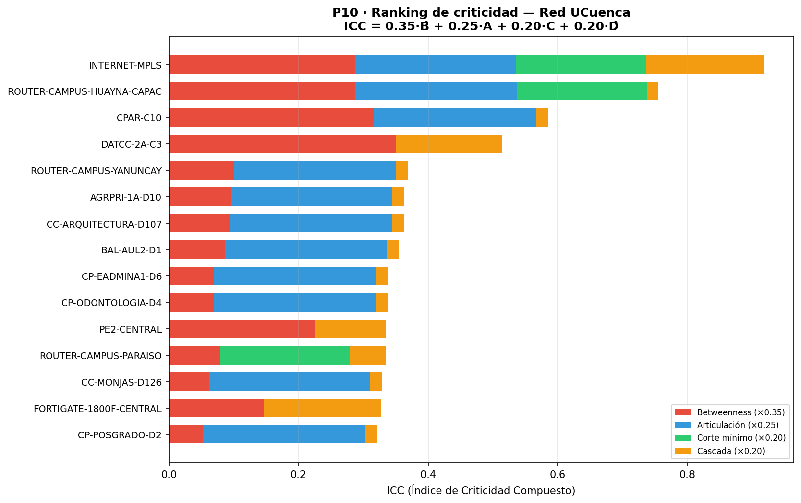{width=42%}

{width=50%}

---

## Problema P11 — Intervención acotada y justificada

Con el diagnóstico de P10, se propone una intervención de exactamente **cinco enlaces nuevos**: ninguno puede duplicar uno existente y cada uno debe resolver un problema del ranking ICC.

### Ítem 1 · Descripción de los cinco enlaces propuestos

| # | Enlace | Capacidad | Problema que resuelve |
|---|--------|-----------|--------------------------------------|
| E1 | CPAR-C10 → INTERNET-MPLS | 1 000 Mbps | Elimina ROUTER-CAMPUS-HUAYNA-CAPAC (ICC #2) como único intermediario Paraíso–backbone: si el router falla, el tráfico sigue por CPAR-C10. |
| E2 | DATCC-2A-C3 → CPAR-C10 | 10 000 Mbps | Vía directa de 10 Gbps entre cores de Central y Paraíso: reduce el daño en cascada de DATCC-2A-C3 (ICC #4) y da a CPAR-C10 (ICC #3) segunda ruta al backbone. |
| E3 | ROUTER-CAMPUS-YANUNCAY → PE2-CENTRAL | 1 000 Mbps | Elimina ROUTER-CAMPUS-YANUNCAY (ICC #5) como salida única de Yanuncay, usando el PE2-CENTRAL infrautilizado. |
| E4 | CP-ODONTOLOGIA-D4 → CP-EADMINA1-D6 | 1 000 Mbps | Cross-link entre dos agregaciones de Paraíso (ICC #9, #10): anillo parcial donde uno absorbe los flujos del otro si cae. |
| E5 | BAL-EADM-D3 → DT-0A-C13 | 1 000 Mbps | Segundo uplink para el switch de administración de Balzay (antes con un solo core): elimina su condición de punto de articulación. |

### Ítem 2 · Cuantificación de la mejora — tabla antes / después / variación

Métricas sobre la red original y la modificada con los cinco enlaces; flujo máximo con fuente en el core de cada campus hacia INTERNET-MPLS.

| Métrica | Antes (original) | Después (propuesta ICC) | Δ absoluto | Δ relativo |
|---------|-----------------|------------------------|-----------|-----------|
| Aristas totales | 209 | 214 | +5 | +2.4% |
| Puentes | 141 | 137 | −4 | **−2.8%** |
| Puntos de articulación | 47 | 46 | −1 | −2.1% |
| Distancia media | 5.830 | 4.976 | −0.855 | **−14.7%** |
| Eficiencia global $E_0$ | 0.2082 | 0.2330 | +0.0247 | **+11.9%** |
| $f_c$ bajo ataque por grado | 0.011 | 0.011 | 0 | 0% |

El flujo máximo por campus (antes vs. después, figura siguiente) mejora en Central (5 000→6 318 Mbps, +26.4%) y sobre todo en Paraíso (318→6 318 Mbps, **+19×**), sin cambios en Balzay (3 290 Mbps) ni Yanuncay (1 000 Mbps). El impacto más notable es Campus Paraíso: el flujo máximo se multiplica por 19 porque E1 y E2 juntos abren una ruta de 10 Gbps hacia el backbone (Central → DATCC-2A-C3 → INTERNET-MPLS). La reducción del 14.7% en distancia media refleja que E2 acorta todos los caminos entre los dos campus más grandes.

La reducción de puentes (−4) y articulaciones (−1) es modesta porque la mayoría de los puentes son hojas de acceso a un único switch de agregación, que no se pueden eliminar sin cableado adicional interno.

El umbral $f_c$ (fracción en que $E$ cae al 50% de $E_0$) es idéntico en todas las variantes ($f_c=0.011$, apenas 2 nodos), confirmando lo visto en P8: la red sigue siendo extremadamente frágil a ataques dirigidos a sus hubs, porque el primer hub eliminado (DATCC-2A-C3, grado 17) desconecta masivamente la red en ambas versiones. La intervención mejora la operación normal pero no transforma el perfil de robustez ante ataque deliberado — eso requeriría redundancia a nivel de core.

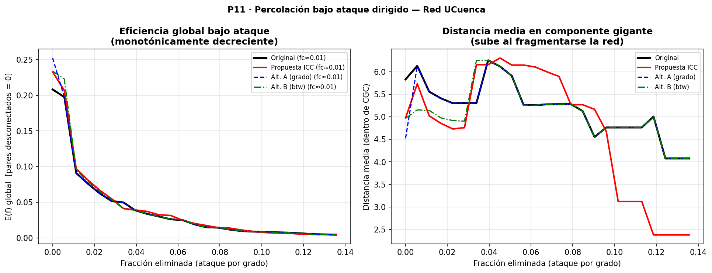{width=50%}

{width=50%}

### Ítem 3 · Justificación frente a alternativas

Se compararon dos alternativas de cinco enlaces:

**Alternativa A — mayor grado:** conectar los cinco nodos de mayor grado entre sí: DATCC-2A-C3 → {AGRPRI-1A-D10, BAL-AUL2-D1, CP-EADMINA1-D6, DT-0A-C13, INTERNET-MPLS}.

**Alternativa B — betweenness pairwise:** ROUTER-CAMPUS-HUAYNA-CAPAC → {DATCC-2A-C3, DATCC-2A-C2}, ROUTER-CAMPUS-YANUNCAY → DATCC-2A-C3, CPAR-C10 → DATCC-2A-C2, DT-0A-C13 → INTERNET-MPLS.

| Métrica | Original | Propuesta ICC | Alt. A (grado) | Alt. B (btw) |
|---------|----------|--------------|---------------|-------------|
| Puentes | 141 | **137** | 138 | 140 |
| Articulaciones | 47 | 46 | **45** | 46 |
| Distancia media | 5.830 | 4.976 | **4.521** | 4.966 |
| Eficiencia global | 0.2082 | 0.2330 | **0.2524** | 0.2339 |
| Flujo Campus Paraíso | 318 | **6 318** | 395 | 1 318 |
| Flujo Campus Yanuncay | 1 000 | **1 000** | 2 000 | 1 000 |

La Alternativa A mejora más la eficiencia global (+21.2% vs +11.9%) y la distancia media, pero **fracasa en el problema más crítico**: Campus Paraíso sigue con solo 395 Mbps (vs 6 318 de la propuesta ICC), porque conectar hubs de mayor grado entre sí no resuelve que el router de Paraíso siga siendo punto único de paso. La Alternativa B mejora la eficiencia casi igual (+12.3% vs +11.9%) pero tampoco resuelve Paraíso (1 318 Mbps vs 6 318): construye rutas paralelas al backbone sin añadir capacidad donde más se necesita.

**La propuesta ICC es superior en el indicador más relevante operativamente —flujo hacia Paraíso— y la única que aborda directamente los tres nodos del top-4 ICC** (ROUTER-CAMPUS-HUAYNA-CAPAC #2, CPAR-C10 #3, DATCC-2A-C3 #4); las alternativas optimizan métricas agregadas pero no la criticidad estructural.

### Ítem 4 · Estimación de costo y factibilidad

| Enlace | Factibilidad | Consideraciones |
|--------|-------------|----------------|
| E1: CPAR-C10→INTERNET-MPLS | **Media** | Segundo circuito MPLS al ISP para Paraíso; costo recurrente mensual, sin obra civil si ya existe ducto al POP. |
| E2: DATCC-2A-C3→CPAR-C10 | **Baja** (inter-campus) | Campus separados por kilómetros; requiere fibra oscura o circuito dedicado, alta inversión. Alternativa: VPN sobre MPLS existente mientras se planifica el tendido. |
| E3: ROUTER-CAMPUS-YANUNCAY→PE2-CENTRAL | **Media** | Segundo circuito MPLS para Yanuncay; PE2-CENTRAL ya existe, depende de puertos disponibles. |
| E4: CP-ODONTOLOGIA-D4→CP-EADMINA1-D6 | **Alta** | Mismo campus, cable corto (~100 m), costo mínimo; verificar puertos libres. |
| E5: BAL-EADM-D3→DT-0A-C13 | **Alta** | Mismo campus, BAL-EADM-D3 (grado 2) probablemente con puertos libres; obra civil mínima. |

En resumen: E4 y E5 son ejecutables de inmediato con recursos internos; E1 y E3 requieren negociación con el ISP; E2 es la de mayor impacto y mayor inversión.

### Ítem 5 · Limitaciones del estudio

**Lo que el modelo no captura:** el grafo se construyó a partir de diagramas de red, no mediciones en tiempo real, así que los Mbps son capacidades nominales contratadas, no tráfico real cursado (requeriría NetFlow/SNMP en producción). El betweenness como proxy de carga asume enrutamiento por caminos más cortos, pero OSPF/MPLS enrutan según costo configurado, no topología pura. Motter-Lai supone redistribución instantánea y uniforme, ajena a la convergencia real de OSPF y a mecanismos de protección (Spanning Tree, HSRP/VRRP, Fast Reroute MPLS) que en la práctica limitan cascadas. La propuesta de cinco enlaces asume disponibilidad de puertos y ductos sin restricciones físicas verificadas.

**Datos que harían falta:** matrices de tráfico origen-destino por hora, logs de incidentes de 2–3 años, topología con redundancias lógicas (VLANs, VPN, rutas OSPF alternativas), inventario de puertos disponibles.

**Conclusiones que NO pueden extraerse:** no se puede predecir cuándo fallará un nodo específico (modelo estructural, no temporal); alta betweenness/criticidad topológica son problemas de disponibilidad, no de ciberseguridad; y la propuesta de cinco enlaces no es necesariamente la solución óptima combinatoria (encontrar el conjunto óptimo de $k$ enlaces es NP-difícil; aquí se usa heurística guiada por ICC).

*(Fase 5 — Propuesta de Rediseño, peso 3 pts, contenido 5.1 del sílabo: corresponde íntegramente al Problema P11 anterior.)*

---

## Conclusiones generales

La red UCuenca (177 nodos, 209 aristas) es una infraestructura **jerárquica diseñada**, no una red emergente: densidad muy baja (0.013), clustering casi nulo (0.034) y asortatividad negativa ($r=-0.147$) son la firma estructural de la topología en estrella core→agregación→acceso, confirmada de forma independiente en P1 (contraste con modelos nulos ER/CM), P2 (comparación con Barabási-Albert) y el test MLE/bootstrap de ley de potencia (P1), que no permite afirmar con rigor que la red sea *scale-free* dado el tamaño reducido de la cola de grado (20 de 177 nodos).

**Sobre optimización (Fase 3):** los tres modelos de peso (saltos, latencia, carga) dan rankings de centralidad distintos, evidencia de que "el nodo más importante" depende de qué se está optimizando. El hallazgo más fuerte de esta fase es metodológico: la heurística voraz para p-centro (P7) tiene un **gap de hasta 100% frente al óptimo exacto** (solver de programación entera, PuLP/CBC) para $p=5$ — greedy da radio 6, el óptimo da radio 3 — mientras que para p-mediana el gap es marginal (≤5%). La lección para cualquier problema de localización en esta red: verificar siempre contra un solver exacto cuando el objetivo es min-max, no solo confiar en la heurística.

**Sobre robustez (Fase 4):** la red es estructuralmente resistente a cascadas de sobrecarga (Motter-Lai) — ni siquiera con $\alpha=0$ (sin margen de tolerancia) la falla de un solo nodo, evaluada sobre los cinco nodos de mayor betweenness, provoca una cascada que afecte al 20% de la red (máximo observado: 6.8%). Esto se debe a que el 64% de los nodos son hojas de grado 1 que no redistribuyen carga al fallar. En cambio, la red **sí es vulnerable a epidemias tipo SIR**: con $\beta$ apenas el doble del umbral crítico teórico ($\tau_c=0.186$), el brote promedio (30 realizaciones) afecta a ~79% de los nodos, y la estrategia de inmunización por grado reduce eso a ~3% con solo 20% de cobertura — la paradoja clásica de redes heterogéneas: robustas a fallos aleatorios y a cascadas de carga, vulnerables a ataques/epidemias dirigidas a los hubs.

**Sobre la propuesta de rediseño (P11):** los cinco enlaces guiados por el índice compuesto de criticidad (ICC) mejoran la eficiencia global en 11.9% y reducen la distancia media en 14.7%, con el mayor impacto operativo en Campus Paraíso (flujo máximo hacia el backbone multiplicado ×19). Sin embargo, el umbral de percolación $f_c$ bajo ataque dirigido a hubs no cambia (0.011 antes y después): la intervención mejora la operación normal pero no transforma el perfil de vulnerabilidad ante un ataque deliberado a los switches de core — eso requeriría redundancia real a nivel de core, no solo enlaces adicionales en la periferia.

**Recomendación:** priorizar los enlaces E4 y E5 (factibilidad alta, mismo campus, costo mínimo) para ejecución inmediata; negociar E1 y E3 con el ISP a mediano plazo; evaluar E2 (el de mayor impacto en eficiencia global) como proyecto de inversión de fibra inter-campus. Independientemente de la intervención, vacunar/parchear por grado (no aleatoriamente) es la política de mayor retorno para contener incidentes de propagación lógica con el menor presupuesto de intervención.

## Referencias

Clauset, A., Shalizi, C. R., & Newman, M. E. J. (2009). Power-law distributions in empirical data. *SIAM Review*, 51(4), 661–703. https://doi.org/10.1137/070710111

Motter, A. E., & Lai, Y.-C. (2002). Cascade-based attacks on complex networks. *Physical Review E*, 66(6), 065102. https://doi.org/10.1103/PhysRevE.66.065102

Newman, M. E. J. (2010). *Networks: An introduction*. Oxford University Press.

Barabási, A.-L., & Albert, R. (1999). Emergence of scaling in random networks. *Science*, 286(5439), 509–512. https://doi.org/10.1126/science.286.5439.509

Erdős, P., & Rényi, A. (1959). On random graphs I. *Publicationes Mathematicae*, 6, 290–297.

Blondel, V. D., Guillaume, J.-L., Lambiotte, R., & Lefebvre, E. (2008). Fast unfolding of communities in large networks. *Journal of Statistical Mechanics: Theory and Experiment*, 2008(10), P10008. https://doi.org/10.1088/1742-5468/2008/10/P10008

Ford, L. R., & Fulkerson, D. R. (1956). Maximal flow through a network. *Canadian Journal of Mathematics*, 8, 399–404. https://doi.org/10.4153/CJM-1956-045-5

Pastor-Satorras, R., & Vespignani, A. (2001). Epidemic spreading in scale-free networks. *Physical Review Letters*, 86(14), 3200–3203. https://doi.org/10.1103/PhysRevLett.86.3200

Astudillo-Salinas, F. (2026). *Módulo 1217 — Redes Complejas: material del curso*. Universidad de Cuenca. https://github.com/fabianastudillo/ComplexNetworks
